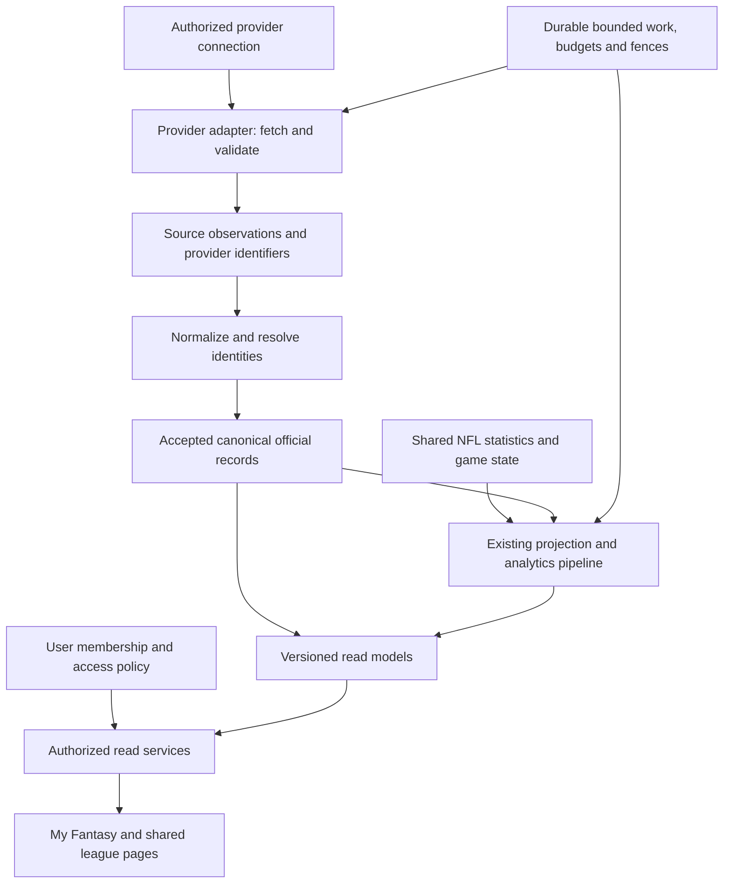

# Aggregator backend contracts and migration design

Status: proposed implementation contract, 28 September 2026. This package defines the backend foundation; it does not implement a connector, alter enrollment, run a migration, change a calculation, or establish production capacity.

The first package-2 code slice is recorded in [retained roster implementation](roster-implementation.md). It adds common contract validators and an internal roster comparison through the existing store/reader path; the broader migration and read-service cutover remain pending.

## Purpose and completion gate

League One collects a bounded set of league information, translates provider-specific representations into shared records, and serves a consistent portfolio and league-detail experience. Host providers remain authoritative for their own official records. League One adds presentation calculations and separately qualified forecasts.

This design stage is complete when each required screen value has an identified source, internal representation, period, authority, and missing-data behavior, and representative second-provider differences fit the contract or have an explicit unavailable outcome. A documentation-based Yahoo probe satisfies early design comparison; a real authorized Yahoo account remains an implementation qualification gate.

| Document | What it establishes |
| --- | --- |
| [Contracts](contracts.md) | Collection scope, canonical records, timestamps, completeness, feature support, adapter and reader boundaries |
| [Screen data map](screen-data-map.md) | Existing screen values, source paths, target read contracts, and continuity requirements |
| [Provider comparison](provider-mapping.md) | Sleeper/Yahoo field mappings, representative examples, evidence, and unresolved live-provider questions |
| [Migration design](migration.md) | Existing-table reuse, additive changes, backfill, comparison, cutover, rollback, and acceptance gates |

## Design completion evidence

| Requested outcome | Evidence in this package | Result |
| --- | --- | --- |
| Specify what we collect | Bounded resource catalogue and per-screen field groups, including official facts, sports inputs, preferences and derived values | Defined for current product screens |
| Define identities and provider mappings | Internal IDs, opaque source aliases, seasonal continuity, unresolved entities, native periods and source-mapping revisions | Defined; existing IDs preserved |
| Define timestamps and completeness | Observation envelope, immutable request coverage, ordering/fences, partial-read policy and per-field provenance | Defined; source age is separate from processing time |
| Define feature support | Independent access, availability, completeness, freshness and per-feature support; official-only enrollment path | Defined; unsupported analytics do not hide reliable official facts |
| Check a second provider early | Official Yahoo specimens compared with Sleeper, including composite keys, counted slots, points, settings and periods | Documentation comparison complete; authenticated current-season qualification pending |
| Explain required screen values | Source functions, authority, scope, missing-data behavior and target read contracts in the screen map | Current screen value groups accounted for |
| Design a safe migration | Reuse map, staged expansion/backfill/comparison/cutover, conditional rollback and acceptance gates | Defined; execution remains separate |

The design gate is met at the documented-contract level. It does not certify implemented DTOs, production schema compatibility, live Yahoo access, forecast coverage or load capacity. The implementation packages below require those separate proofs before activation.

## Baseline and scope

- GitHub `main` and Vercel Production were checked at `92b8b0b191530cd6699e534fe66dbe95f60da16a`. Production was Ready, bound to `clawmachinejed/league-one-audit`, branch `main`, root `apps/site`.
- The primary local checkout remained clean at `962d8708881c76a1bec9767cc659357b0206ad30`; the intervening commit changes only README/AGENTS. The isolated design worktree starts at current `main`.
- Existing runtime contracts, `clock-v1`, exact-week behavior, frozen baselines, scoring hashes, snapshots, routes, guest preferences, and published history remain the compatibility baseline. This proposal does not silently replace them.
- Keep the modular application and existing workers, readers, normalization, scoring, and publication ownership. An adapter is a module, not a requirement to introduce a microservice.
- Initial scope remains NFL fantasy football. Provider-neutral storage does not imply support for every scoring event, competition format, or provider.
- Commercial provider approval, credentials, real-account qualification, load measurement, forecast changes, and production migration execution remain later work with separate evidence.

## Intended flow

Source evidence, official records, and calculated outputs have different authority and lifetimes. They may use the same Postgres database. Read models can reference existing snapshots; this design does not require a second copy of every underlying record or another publication pipeline.

## Decisions

1. Preserve stable internal IDs and provider-qualified external references. Names and roster numbers never identify global entities by themselves.
2. Keep native settings and facts with versioned normalization. Unknown values remain explicit rather than receiving invented defaults.
3. Separate access, availability, completeness, freshness, and feature support. A single league-wide supported/unsupported flag is insufficient.
4. Permit reliable official data independently of scoring-profile compilation. Do not create a placeholder zero profile to satisfy legacy constraints.
5. Distinguish official points, provider forecasts, League One forecasts, and presentation-derived ranks. Unknown is not zero; an empty collection is not a failed request.
6. Scope source heads, materializations, and caches to the proven data audience. Check permission on deep links and stored reads as well as fetches.
7. Migrate by resource/reader slice with a single authoritative writer. Compare transformations against the same capture instead of adding duplicate upstream collectors.
8. Use Yahoo documentation to challenge the model now. Require approved live access and real NFL samples before connector activation.

## Implementation packages

| Package | Deliverable | Exit evidence |
| --- | --- | --- |
| A: domain contracts | Typed records, validators and mapping fixtures corresponding to this design | Screen-map coverage; identity/period/null semantics; retained native fields; contract versioning |
| B: persistence and Sleeper translation | Additive schema/functions and compatibility views; replay accepted evidence into proposed records | Existing IDs/history unchanged; same-source comparison; safe replay and rollback |
| C: shared readers and account context | Authorized summary/detail readers, consistent team identity, independent feature support | Existing feature journeys; official-only league exercise; grant revocation and cache isolation |
| D: second-provider pilot | Approved Yahoo connection, real NFL samples, resource adapters, shared views | Documentation/live mapping reconciled; unsupported fields explicit; privacy qualification |
| E: growth qualification | Bounded work/continuation and measured read/collection budgets | Outage/correction/replay recovery; capacity, freshness, latency, retention and cost targets |

Begin access qualification and representative fixture work alongside A/B. Reconcile real second-provider feedback before broad schema/reader cutover; do not defer discovery of source differences until package D. If authorized access is not yet available, contract work may proceed using documented specimens, but that qualification gate stays open. Enrollment expansion waits for the applicable access and growth gates.

## Decisions and evidence required during implementation

The documented design accounts for current screen values; it does not establish every launch decision or prove a live integration. The following items remain open until an implementation task records the stated evidence. They do not all block starting package A.

| Item | Required evidence or decision | Deadline |
| --- | --- | --- |
| Initial support boundaries | Provider/league-format/feature matrix covering official viewing separately from analytics; supported, limited, unavailable or unverified outcomes and their user-visible behavior. Preserve current Sleeper behavior. | Before implementing the affected new-provider feature/presenter; before admitting that format. |
| Real second-provider data | Authorized, sanitized current-season examples covering account/team relationships, settings, current/past lineups, scores/results and transaction coverage; record differences from documentation. | Start alongside A/B; reconcile before broad schema/reader cutover and before connector activation. |
| Freshness expectations | Resource-specific target age, stale-display limit, refresh priority and request budget for live scores, rosters, transactions and history. Record measured behavior and the user-visible stale/unavailable policy. | Before finalizing collection schedules or new-provider reader freshness policies; no existing cadence change is authorized here. |
| Data evolution | Executable old/new fixtures for adding fields, provider format/meaning changes and official corrections, following [the change contract](contracts.md#9-adding-data-and-handling-provider-changes). | Package A, extended by each affected adapter and reader implementation. |
| Migration comparison | Per-screen expected values and provenance for normal, partial, stale, corrected and rollover cases; stable reason codes for missing data. No unexplained official-value or existing-projection differences; any numeric tolerance must be field-specific and justified. | Before switching each resource/reader cohort. |
| Access and retention | Established provider access authority and applicable storage/display conditions; tested audience isolation, revocation and retention handling. | Before collecting private pilot data under that authority; full activation qualification before enabling the provider. |

Maintain these decisions and fixture references with the screen map as features change. Adding a new feature also requires checking whether its information needs extend the bounded collection catalogue; the current inventory is not a promise to cover every future feature.

## Implementation review checklist

- Every screen-map row has a typed contract, mapping fixture, and continuity test when implemented.
- Incomplete identity, unknown scoring contribution, absent permission, empty roster, stale result, and provider failure remain distinguishable.
- Official-only enrollment cannot reach legacy projection code that requires a compiled profile.
- Materialization cannot mix an unrelated league, period, configuration, audience, or frozen baseline.
- Each migration stage has a read/write owner, rollback boundary, and retained-history rule.
- Yahoo gaps remain qualification items rather than claims of implemented capability.

This package defines those gates. A design-only PR does not mark runtime gates complete.
