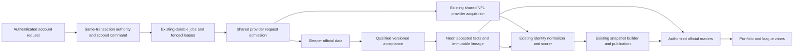

# Full backend build plan

Revision `backend-build-plan-v1`. This plan covers the complete approved aggregator mission: portfolio, accounts and access; official league/roster/lineup/score/standings/transaction/schedule/history data; shared NFL identities, statistics, projections and game states; derived forecasts; collection, storage, serving, recovery, privacy, cost and release. Sleeper is the implemented provider; later adapters have a separate qualification milestone.

## What complete planning means

The lead engineer owns the decisions. [The decision register](backend-decisions.md) resolves D03–D05 and selects eight cross-cutting engineering policies. [The full coverage matrix](backend-coverage.md) assigns every currently identified obligation a source, data meaning, accountable role, design, milestone, dependency and independent acceptance procedure. The [108 detailed first-slice requirements](requirements-traceability.md) remain the finer-grained contract for identification through authorized stored current-roster reads.

Planning coverage means every enumerated need and lifecycle concern has those allocations, including explicitly unsupported cases and the work needed to qualify them. It does not mean all later feature schemas or executable tests have already been produced. BC-M2 and BC-M3 contain mandatory detailed-design deliverables before their implementation starts. No later milestone may use a coverage row as a substitute for those deliverables. Unknown provider behavior stays an explicit qualification dependency. A missing owner, unbounded interface, unanswered applicable policy, orphan source field or absent acceptance procedure fails the coverage gate.

There is no single universal textbook that certifies an aggregator. We use a tailored method profile: database requirements → conceptual ER model → logical schema/normalization → physical DDL/privileges → implementation → verification → maintenance; bidirectional requirement/evidence traceability; risk-driven secure design and independent review; and service objectives, capacity, overload and recovery engineering. The source-by-source applicability inventory remains in [methodology-steps.md](methodology-steps.md). Historical inventory counts are not a percentage-complete score and a workshop is not claimed merely because a document uses its method.

## Selected architecture and ownership

Admission is provider-specific: Sleeper's numeric budget is not applied to Tank01 or treated as its quota. Account identities, source identities, source permission, current membership, follow intention and view demand remain separate. Public accessibility does not make an actor's association, preference or private result public. Shared source evidence is reused only across compatible provider/resource/audience/coverage scopes. Actor authorization is checked on every protected delivery, including caches and background-completed results.

Neon remains the transactional store and immutable lineage owner. Existing job, observation, projection and publication paths remain the only owners. We select a continuous execution mode of the same Node worker for sub-minute scheduling. The planning host selection is a Render Background Worker with a pinned application artifact, one active fenced owner and a standby only after failover qualification; Vercel continues serving the website. Render documents continuous background workers; its hosting role does not introduce Redis, another queue or a parallel collection path. Region must be selected from actual Neon location and measured round-trip latency. Instance size, standby cost, commercial authority and the service account are BC-M4 evidence gates before provisioning. No host or secret was created by this plan. [Render worker documentation](https://render.com/docs/background-workers).

Migration to continuous mode first proves exclusive lane ownership against the existing cron paths. Disable provider work in the old lane only as its same-owner execution moves, using a durable generation fence; an overlap can never duplicate permitted work or publication. Existing current/observer/future role boundaries remain. A failed handover returns ownership to a known fenced generation, never two live writers.

## Data contract and completeness rules

Every resource family must state: provider and native key; canonical stable identity; season and competition period; visibility and acquisition authority; raw field presence states; units and numeric domain; capture/request/acceptance/source timestamps; schema/normalizer/validation versions; exact audience and coverage; immutable evidence reference; mutable accepted-head ordering rule; correction and deletion semantics; and downstream consumers. Optional fields use known/empty/absent/null/invalid semantics where applicable. Zero is a value, including official custom scores; missing is never fabricated zero.

The provider owns official rules, lineup, score, final result, schedule and rank when supplied. A League One calculation must carry its own method/version and derived label. Provider finality, individual NFL game finality, locally settled views and immutable kickoff baselines are different states. Late official corrections append accepted evidence and invalidate dependent derived output; they never rewrite frozen pregame baselines. Historical display labels and scoring settings require time-applicable versions, not today's metadata projected into an old season.

BC-M2 must produce a family manifest and exact field/constraint/coverage register for league settings, teams and roles, held rosters, exact-period lineups/matchups, official scores/results/standings, transactions including FAAB/draft picks and published status, calendar/schedule/playoffs, drafts and recoverable history. Native competition periods support preseason, regular season and postseason; median games, best ball, multiweek ties and unsupported rules are explicitly qualified per official or derived feature. Reliable official representation can ship while a derived feature remains unavailable.

BC-M3 must map shared NFL schedule, player/defense identity, actuals, injuries where licensed, game state and projection statistics through the current crosswalk, normalizer, scorer, `clock-v1` and snapshot builder. It must preserve exact-week scope, source-skew rules, bye policy, trusted-slate missing-projection policy and frozen-baseline immutability. Probability verification includes both deterministic calculation and held-out calibration/backtesting, with training/evaluation time boundaries and no future-data leakage. A deterministic unit pass is not forecast quality proof.

## Freshness, capacity and overload

These are selected targets for qualification, not deployed settings or measured guarantees. Aggregate public Sleeper admission is 900 actual HTTP starts in any rolling 60 seconds. The documented under-1,000 guidance is not a contractual quota. The measured start is the owned local transport dispatch boundary; network-delayed remote arrival is not proved by the local admission bound. Every real call counts, including retries, alternate hosts, framework revalidation, catalog loads, fallbacks and full-source loads. A crashed or unused permit stays charged. A permit that cannot start within one second expires; retaining charges for 61 seconds bounds a60-second start window. The transport must check the deadline immediately before dispatch using a validated monotonic elapsed-time bound; a delayed process cannot later dispatch an expired permit. A database or time-bound uncertainty fails closed for acquisition.

| Lane | Charged grants per 61 seconds | Selected healthy cadence / workload |
| --- | ---: | --- |
| Live official score/active lineup | 680 | 500 distinct watched leagues at 45 seconds; full-source load and thin observation deduplicate |
| Roles and current held roster | 55 | 500 leagues at 600 seconds; one compatible response feeds both |
| Current transaction activity | 100 | 500 leagues at 310 seconds; backlog/cursor maintained |
| Settings, directory, NFL authority | 20 | League settings and directory at 3,600 seconds; shared operational state at 60 seconds |
| Interactive identify/recovery discovery | 15 | Shared durable queue, per-actor limits, truthful pending state |
| Imports, history and future preparation | 15 | Fair bounded work; explicit completion/coverage, preserved named-league obligations |
| Retries | 15 | Fresh permit on every attempt, bounded exponential backoff and jitter |

Total is 900. Lanes initially do not borrow. Same-lane scheduling uses deterministic round-robin/age priority over resource identities so many users following one league do not multiply acquisition. Global provider concurrency is 32 and HTTP deadline5 seconds. Queueing is bounded, oldest due age is observable, duplicate demands coalesce and rejected/paused work retains an honest status. No worker scales out to evade the shared rate bound. Per-actor and queue caps are specified in [acquisition admission](acquisition-admission-design.md).

At500 leagues, scores need `500 × 61 / 45 = 677.78` grants per 61 seconds, very close to 680. Roles need50.84; transactions98.39. Settings/directory together consume16.95, leaving a small state/administration allowance. This arithmetic reveals a narrow margin; it does not prove scheduling, latency, retry or database capacity. At2-second mean provider latency, roughly30 requests may be concurrent at 15 starts/second. At5 seconds the same concurrency cap throttles starts, and freshness degrades visibly instead of violating limits.

The score target is additional League One delay p95≤60 seconds and p99≤75 seconds during live play. Record provider-effective time when trustworthy, previous comparable successful poll, request start/completion, acceptance, publication, authorized read and visible render. Where the provider change timestamp is unavailable, report the conservative changed-value upper bound from the previous successful comparable observation; first observation has unknown change age. Capture-to-render alone cannot prove total delay. Use synthetic controlled changes to establish end-to-end latency independently. Report overall and dependency-attributed results, rejected/unknown samples and stale user-minutes. Never drop failed samples from the headline result.

Existing future-period cadence across 500 leagues would exceed the import/future reservation. We do not conceal that mismatch: preserve the two named leagues' established cadence; admit additional future work within measured capacity with explicit coverage and queued progress. Before claiming both500 live leagues and full requested future service, BC-M4 must either demonstrate sufficient deduplication/workload headroom or obtain and qualify a larger licensed provider allowance with a reviewed budget revision. Otherwise cap admitted capacity and keep importing/derived coverage visible. Official current-season data remains recoverable through resumable import; an over-budget target is not silently declared supported.

## Service operation, privacy and recovery

The lead engineer is accountable for assigning the SRE/release role before public activation. Stored authorized-read availability target is 99.9% over 28 days, server p95≤500ms/p99≤1,500ms under the qualified workload. Correctly denied unauthorized requests are valid security outcomes; unavailable/indeterminate legitimate reads count as unsuccessful. Track latency, data freshness, completeness, authorization correctness and successful publication separately. No availability improvement may relax authorization, fabricate official data or overwrite an immutable baseline.

Create dashboards and runbooks for source errors/schema drift, request starts and denied permits, oldest due work by family, lease loss, stale authority, capture-to-accept-to-publish delay, invalid/superseded evidence, membership expiry, lock waits/deadlocks, database connections/storage, cache isolation, forecast coverage and expenditure. Page the duty owner for a protected-data leak, corrupted publication or duplicate writer immediately; stop the affected path. Page for no live accepted score for 120 seconds across≥10% of watched leagues for 5 minutes, repeated worker heartbeat gaps>30 seconds, or failed backup/restore checks. Low-demand single-league faults create an actionable ticket with redacted context. These thresholds are initial policy and must be checked for actionable alerts during rehearsal.

Error-budget policy: if the 28-day valid-read budget is exhausted, halt ordinary feature rollout; permit fixes reducing the outage/security risk. Investigate dependency and L1 causes separately without removing failures from user-visible reporting. A failed freshness capacity qualification blocks expansion even if read availability passes. No claim is made that24/7 human coverage already exists; a staffed duty schedule and escalation receiver are BC-M4 activation evidence.

Acknowledged durable commands survive a single worker/process crash with no committed data loss. Regional disaster objectives are RPO≤5 minutes and RTO≤60 minutes, contingent on actual Neon service capability, backup retention and a timed isolated restoration. Freeze writes during uncertain restore identity, restore authority and immutable references together, reconcile acknowledged jobs, rotate compromised credentials if applicable, and revalidate before serving. Restore never starts against production from the destructive test harness. Failover targets and restore targets are acceptance requirements, not service entitlements we have purchased.

Retention is selected in D05/ENG08. Diagnostic events keep the existing seven-day maximum; the 90-day case-record timer excludes existing append-only identity audit and immutable provenance. Recovery/import demand authorizes only its own bounded purpose and never keeps normal score/transaction polling alive for an ineligible follow. Reference closure, privacy holds and provider terms govern disposal; the last follower never deletes another user's shared facts. Keep personal associations/preferences separate from shared official records. Account export is actor-scoped and reauthorized at delivery; deletion revokes access before asynchronous scrubbing. Logs exclude raw sessions, receipt digests, email, tokens, native IDs and provider payloads. Minimized operational references and audit identities are restricted to their stated purpose. Backup expiry and contractual/legal retention exceptions require recorded evidence before activation; this plan does not assert jurisdictional legal compliance.

## Build sequence and stop conditions

| Milestone | Deliverables and dependencies | Owner and exit evidence |
| --- | --- | --- |
| BC-M0 | Full-scope coverage; selected decisions; reviewed first-slice ERD, relational schema, DDL, transaction/privilege/admission protocols; independently challenged acceptance plans | Lead/data/security: no unallocated obligation or applicable open policy; reproducible document/model checks and semantic review. This is the current planning deliverable |
| BC-M1 | Implement shared identify → associate → discover → current teams → authorized stored roster service; exact additive migrations/helpers/guards and atomic existing-job admission; D03–D05 semantics; no public reader cutover | Account/data/worker:108 detailed requirement cases plus security/admission/lifecycle cases executed on real implementation; guarded isolated PostgreSQL role/lock/rollback tests; unrelated Sleeper fixtures; independent security review |
| BC-M2 | Detailed data/ER/DDL/interface design and implementation for every official family, durable family/period coverage manifest, resumable import, temporal metadata, calendar/renewal/corrections | Adapter/data: every native field/absence/rule classified; parity against retained actual source; all published periods and explicit missing coverage; crash/replay/property tests and consumer contract review |
| BC-M3 | Detailed shared NFL/analytics mappings, scorer applicability, immutable lineage, probability/forecast evaluation and derived coverage | Analytics/data: single acquisition/normalizer/scorer path; exact-week/source-skew/frozen-baseline parity; independent scoring fixtures; no-leakage calibration report; official and derived status separated |
| BC-M4 | Continuous-worker host qualification, mixed-load scale/cost tests, source licensing/quota, alarms/duty ownership, privacy/export/disposal, backup/failover/restore and incident drills | SRE/security/product: measured500-league workload or explicit admitted cap; total bill model including feed/worker/database/web/egress/retention; verified RPO/RTO; real escalation receiver and source authority |
| BC-M5 | Incremental read-path migration, controlled flags, exact-schema compatibility, operational canary/rollback, complete checks, preview and release evidence | Release owner: fresh main/GitHub/Vercel identity; no competing owner observed within explicit census; independent review; protected merge only with release authorization; exact production SHA and both named leagues after release |
| BC-M6 | Future provider adapters and permissions, scoped credentials, terms, field/competition matrices, identity mappings and reuse tests | Adapter/security: provider-specific qualification and actual user authorization; no shipped Yahoo/ESPN claim before that evidence exists |

BC-M2/BC-M3 detailed designs must apply the same textbook outputs before their schema implementation. They can be designed in parallel with BC-M1 only where contracts are stable; their activation depends on shared authority/admission correctness. No dates or staffing estimates are invented. Size the backlog from implemented vertical slices, then forecast from measured delivery; prioritize access/data correctness, durable acquisition, official coverage, analytics, scale and release in that order.

## Three independent checks

1. **Need-to-plan review:** compare mission, source handoff, current consumers and operational lifecycle against every full-scope matrix row; challenge omitted data families and edge cases. Check both directions so a new table, scheduler or policy has a requirement rationale.
2. **Design consistency and counterexamples:** compare ERD, fields, keys, constraints, DDL, helper/role manifests, same-transaction authority and admission protocol. Independently exercise reasoning for concurrency, process death, stale revisions, incomplete source responses, retries and scope changes. Mechanical checks establish only their stated properties.
3. **Qualification/release evidence:** run implemented tests and guarded SQL schedules, retained provider fixtures, full mixed workload, recovery drills and actual preview/release verification at their milestone. Planning cannot mark these executed before the system exists.

The first two reviews produce the current plan and findings record. The third has exact assigned work and pass/fail gates; it remains unexecuted for the target. Existing repository CI protects the unchanged baseline application and is reported separately.

## What remains missing and why

| Missing evidence/output | Why it is still required | Comparison and owner |
| --- | --- | --- |
| Actual implementations, helper bodies/migrations and runtime/SQL test results for the target | Structural DDL and protocol algorithms are design specifications; database enforcement and interleavings need execution | Textbook implementation/testing; SSDF PW.8; BC-M1 data/security |
| Detailed family schemas/ERDs and exact acceptance fixtures for later official/analytics slices | Full-scope allocation is planning coverage, not completed detailed design of every future slice | Textbook requirements/analysis/design; BC-M2/BC-M3 adapter/analytics |
| Commercial source authority and contractual quota, retained unrelated-league evidence | Public documentation cannot establish license, private rights, completeness or upstream guarantees | Actual provider terms/qualification; BC-M4 product/adapter |
|500-league end-to-end capacity, full future-work coexistence and total cost | Simple call arithmetic has little margin and exposes a future-work deficit | SRE SLI/load/overload method; BC-M4 SRE |
| Verified restore, backup, failover, alarms, human escalation and privacy operation | Documents do not prove recovery or staffed operation | SSDF/recovery risk controls and tailored lifecycle validation; BC-M4 SRE/security |
| Approved production cutover and exact deployed target evidence | This planning request does not authorize merge/deployment or destructive changes | Binding repository release rules; BC-M5 release owner |

No open item above is hidden as an unresolved product choice. Each has an owner, milestone, dependency and acceptance gate. Newly discovered requirements reopen the corresponding coverage/design review; they are not discarded to preserve a100% label.
