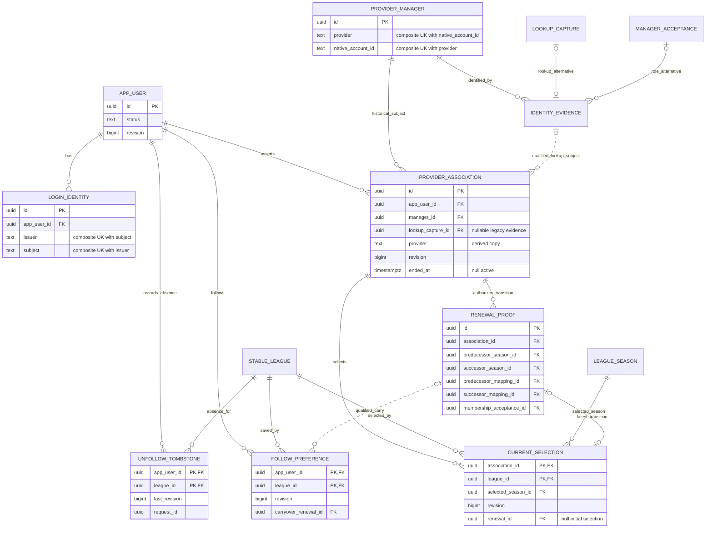
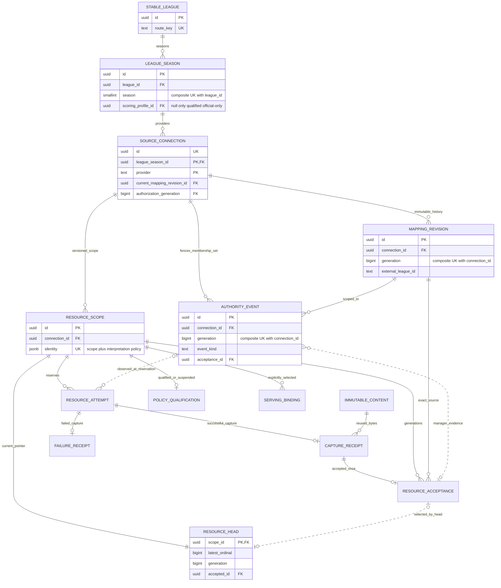
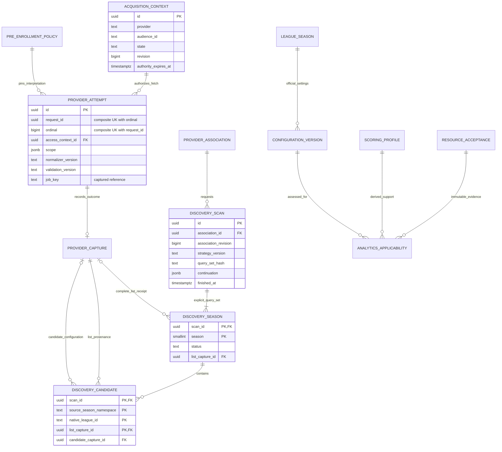
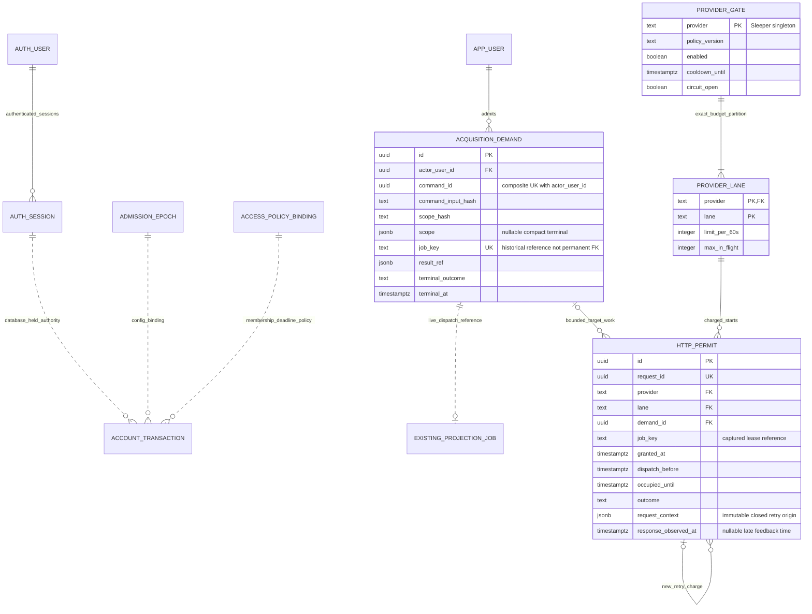

# Relational diagrams and product-domain allocation

This is a **design specification**, paired with [the computable relation model](relational-design.json), [the exact proposed structural SQL](proposed-schema.sql) and [transaction/guard contracts](relational-design.md). It does not assert that the new objects exist. The application database remains unchanged. The diagrams show the logical and physical boundaries needed to build the first slice, with existing owners for the rest of the product.

In Mermaid, `||` means exactly one, `o|` means zero or one and `o{` means zero or many. A solid edge is an identifying/required relationship in this diagram; a dashed edge denotes a logical validated relationship or optional evidence rather than permission to read. Keys shown are selected identifiers; the full key/domain/NULL and historical exceptions are in the JSON/SQL. An evidence relationship never grants user access by itself. Conditional active uniqueness is stated separately; it is not a uniqueness claim about historical rows.

## Identity and private preferences

The manager key is an immutable provider/native ID, never username/display name. Only Sleeper is physically implemented; provider-neutral logical domains do not imply other adapters exist. An actor may retain many ended associations but has at most one active association per provider; a provider manager has at most one active L1 association. Those two partial unique indexes apply only after the authorized conflict census/cutover. `lookup` and `qualified-role` identity evidence are disjoint tagged alternatives; only lookup qualifies the association's subject confirmation. Neither proves external ownership.

Each selection's season belongs to its stable league. Its optional renewal must name that same association, league and successor season. A renewal's membership acceptance must be for the captured successor mapping; the guard checks the relationship beyond mere UUID existence. A follow and its active absence tombstone are mutually authoritative states under the actor lock. The existing preference DELETE audit owns tombstone creation; direct tombstone writes are not exposed. Initial selection has no invented predecessor.

## Stable source identity and immutable evidence

The scope and its head are created atomically by the existing owner; a selected scope cannot lack its head. At most one successful receipt or failure receipt may exist for an attempt **across the two tables**; the attempt lock and outcome guard enforce that cross-table exclusion. The diagram's two optional edges do not allow both. Content reuse never refreshes capture verification time. Old attempts without a reservation authority fence remain historical and cannot prove removal supersession.

The current connection's provider/native alias uniqueness is not a uniqueness claim about all historical mappings or season teams. A–B–A mapping changes receive new immutable revision IDs. The connection's authorization generation fences the whole relevant evidence set, including additions; it is not a synonym for a per-head generation. An adverse event qualified when admitted survives subsequent policy suspension or binding rollback. Only independently proved later evidence can supersede it.

## Pre-enrollment discovery and configuration

No league/season/source-connection ID is invented before enrollment. A scan is complete only for its declared nonempty, sorted unique query set after qualified complete list receipts exist for every required season; it does not prove that the manager has no other current teams. The unfinished partial unique key deduplicates concurrent work; a later explicit completed refresh gets a new scan/request identity and fresh captures. Retries of the original work do not renew its evidence.

Discovery list entries and configuration candidates retain exact native season namespace/ID and their capture. A missing display field is an explicit Field state, never a fabricated provider value. Reliable official data may be represented without an analytics profile; existing nonnull scoring attachments and frozen snapshots remain immutable. Later analytics applicability is a separate assessment with exact configuration/source evidence.

## Authentication and durable acquisition admission

The selected database-owned command fence and shared acquisition admission are specified in [the behavior/security design](behavior-security-design.md) and [the relational protocols](relational-design.md#selected-transaction-protocols). The final account transaction owns the auth advisory/row locks itself. Server-held transactions and transport cancellation are not used as a substitute for database lifetime enforcement.

Existing `projection_jobs` remains the durable dispatch/lease owner. New request-admission records are rate/concurrency accounting and command audit evidence; they are not another queue, scheduler, accepted resource head or provider feed. The proposed SQL inventory and guard manifest specify their concrete relationships. HTTP-start accounting is separate from normalized capture time and membership freshness.

Account transaction is an ephemeral lock/evaluation boundary, not a new table. The auth relationship is implemented by the narrow migration-owner guard; no raw auth privileges cross into the account/runtime role. Its nine-field receipt contains two sensitive digests that are never stored. D03 own-release uses the actual locked session creation time and a maximum five-minute age.

Historical job keys/lease values are validated against a live job at use but deliberately have **no permanent FK** to lifecycle job rows: immutable evidence must not prevent existing job cleanup. Live demand creation/job insertion is still atomic. The demand retains actor+command/input digest/terminal identity after permitted detail compaction; a compacted retry never starts new work. HTTP permits are charged even when a call was never dispatched or completion was unknown; local slot release/quarantine does not prove remote provider cancellation.

## Entire product: preserved ownership and later build allocation

The first slice establishes identity, current eligibility, stored current teams, admission and guarded shared reads. It does not rebuild existing feature storage. Every remaining product domain has an explicit owner and evidence boundary:

| Product domain | Existing owner/storage | Planned extension and completion evidence |
| --- | --- | --- |
| Manager home and cross-league portfolio | `lib/my-fantasy-source.ts`, `lib/accounts`, registry in `lib/config.ts` | Replace temporary team choice only at authorized cutover with qualified association/selection; mixed-year portfolio, per-league failure and route isolation fixtures. |
| Teams, held players, lineups, roles | `lib/league-administration`, resource scopes/acceptances and season-team identities | Reuse manager and current-roster normalizers; independent completeness per group, native/canonical identity and role/removal fixtures. |
| Official matchups/results/scores | `lib/league-matchups-source.ts`, exact-period compatibility and official observations | Preserve exact period/source mapping and official fallback; verify postponed/doubleheader/byes/missing data without substituting projections. |
| Standings and competition formats | accepted official settings/rosters/matchups, shared transformation/readers | Preserve native scoring/rank/tie/playoff rules; expose unsupported derived rankings independently. Later backend plan allocates remaining rule qualification. |
| Transactions, waivers, drafts and picks | administration contents/observations and transaction entries; existing manager history readers | Extend accepted provider family coverage with immutable capture/provenance; retain trade/FAAB/status semantics and labelled gaps. |
| Published schedule and season history | administration matchups, settings, periods; manager-history owner | Recover only provider-evidenced periods and source lineage; current-season completeness matrix, cross-season identity and historical rule qualification. No current timestamp backdating. |
| League settings and scoring versions | configuration versions/activations/heads, existing sole scorer | Preserve native dictionaries and evidenced applicability; later supported analytics binds exact configuration versions. |
| NFL player/game identities and statistics | `projections/shared`, `adapters/tank01`, `adapters/neon`, all-player operation | Keep shared feed/crosswalk and existing backfill operation; no per-league duplicate Tank01 collector. |
| Pregame projections and frozen baselines | `projections/worker`, pregame runs/candidates/baselines | Existing single pipeline/scorer; qualify each scoring dialect and missing-projection/bye coverage. Never mutate frozen baselines. |
| Live forecasts and win probabilities | `projections/domain`, `clock-v1`, worker snapshot construction | Reuse exact-week official points/game progress; independent model validation and coverage, never replace official result. |
| Projected standings | shared derived calculation/readers using exact official and projection evidence | Later analytics applicability and independent model/rule fixtures; no new acquisition owner. |
| Current/future/observer lanes and publication | existing `projections/runtime` dispatch, `projection_jobs`, snapshots/current pointers | Integrate shared HTTP admission at actual starts, retain lane/lease/fence/cadence ownership; fault/concurrency and capacity evidence before activation. |
| Additional league providers | existing ports, adapter and provider identity boundaries | Future adapters plus qualification fixtures; Yahoo/ESPN are not shipped. No speculative provider payload tables or pages. |
| Operations, recovery and privacy | existing account audit, job recovery and release owners | Build-plan milestones allocate retention, restore drills, conflicts/recovery and bounded diagnostics. No destructive cleanup is authorized by this schema. |

All paths above are relative to `apps/site/`; the repository README and source remain authoritative for what exists. See [the full backend build plan](backend-build-plan.md) for milestone ordering and the adopted decision register. This allocation covers planning ownership; it does not claim that later provider completeness, historical recovery, analytical models or the 500-league/latency/cost targets have passed qualification.

## Diagram review and change control

Review each edge against the exact FK or named guard in the SQL/transaction manifest. Test negative examples: wrong actor/manager lookup; season in another league; mapping from another connection; acceptance in another scope; repeated native alias in historical data; simultaneous success/failure capture; reversed mapping/renewal; same request ID with altered interpretation; missing policy qualification; old positive after removal; newer unfollow during renewal; and crash after HTTP admission.

A diagram is an abstraction, not a database enforcement proof. Deployment still requires executable migrations/functions, role-manifest review, isolated fixtures and catalog inspection. The selected logical FD/key model remains independently computable and explicitly labels immutable documents and constrained projections instead of claiming that JSON is universally normalized. PostgreSQL's [constraint rules](https://www.postgresql.org/docs/current/ddl-constraints.html) determine where FK/UNIQUE/NOT NULL applies; cross-row history/transition rules belong to the declared locked guard owner.
