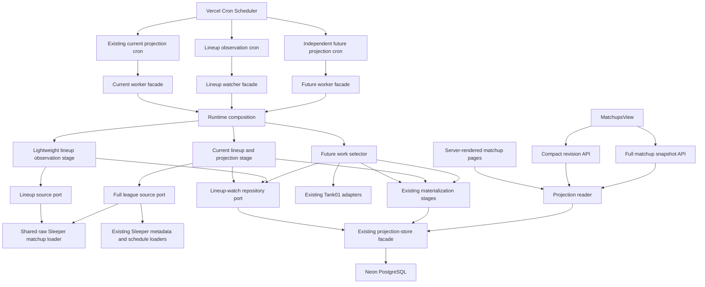

Below is the complete corrected contract. It supersedes every earlier draft and incorporates the final architecture, database, runtime, scheduling, browser, scale, and portability corrections.

:::writing{variant="document" id="68134"}
# Sleeper Lineup Freshness and Projection Rematerialization — Final Implementation Contract

**Contract status:** Final validated implementation specification  
**Reviewed date:** September 3, 2026  
**Reviewed repository commit:** `0bda56f943928bbf4107c19997f593def8ad08cf`  
**Project:** League One Fantasy Football

This contract replaces all previous lineup-freshness and future-week rematerialization plans.

The implementation baseline must be reconfirmed immediately before work begins. If `main` has advanced beyond the reviewed commit, the implementation must record the new starting commit and verify that this contract remains compatible with it.

No implementation begins until explicitly authorized.

## 1. Contract precedence

If requirements conflict, apply them in this order:

1. Production-data safety
2. Required behavioral invariants
3. Database integrity and concurrency rules
4. Explicit non-goals
5. Architecture and dependency rules
6. Pull-request acceptance gates
7. Individual implementation steps

No undocumented deviation is permitted.

If implementation discovers a conflict with current behavior:

1. Stop the affected portion.
2. Record the discrepancy in the drift ledger.
3. Determine whether the contract or implementation assumption is wrong.
4. Resolve the discrepancy before changing production behavior.

Unrelated defects must be documented separately unless they prevent this feature or threaten production integrity.

## 2. Fixed objective

Keep Sleeper lineup assignments reasonably current across every relevant matchup week without unnecessarily rebuilding projections.

The completed system must:

- Check the active scoring week approximately every minute.
- Check future matchup weeks approximately every three minutes.
- Stop automatically checking completed weeks.
- Detect starter changes and matchup-pairing changes using a small Sleeper matchup request.
- Avoid loading player metadata, schedules, users, injuries, projections, or full roster context merely to determine whether a lineup changed.
- Perform no Tank01 work when the lineup revision is unchanged.
- Durably record changed lineup revisions.
- Rematerialize the exact affected league and week through the existing projection pipeline.
- Preserve the existing scoring engine, `clock-v1`, Tank01 normalization, snapshot builder, Neon publication, and safe Sleeper fallback.
- Allow future-week work to continue while current-week live projection work is running.
- Refresh current and future browser pages efficiently without downloading the full matchup payload every minute when nothing changed.
- Preserve all existing website routes, presentation, league selection, manager selection, mobile behavior, dark mode, and accessibility behavior.
- Maintain one projection pipeline, one scoring implementation, one snapshot builder, and one publication path.
- Remain modular and provider-portable at the domain and worker boundaries.
- Stay within a measured and explicitly bounded request and execution budget.

## 3. Current problem being corrected

The current architecture has durable future projection and materialization state, but future work is launched opportunistically from the existing current projection orchestrator.

That creates several limitations:

- Future work can be delayed while current live-game work is active.
- Future starter changes are not observed every few minutes.
- The existing whole-source revision includes request timestamps and cannot represent semantic lineup equality.
- Current browser polling downloads the full matchup snapshot.
- Future matchup pages do not currently poll for refreshed snapshots.
- Period classification relies partly on information that may remain cached longer than the intended current-week cadence.
- Current future-work selection assumes every configured league has matching authority, allowing one unhealthy league to block healthy leagues.

This feature corrects those limitations without introducing a second projection system.

## 4. Explicit non-goals

The following work is excluded:

- No visual redesign.
- No layout change.
- No navigation change.
- No URL removal or renaming.
- No League One or League Two ID change.
- No manager or roster URL change.
- No fantasy scoring change.
- No projection-formula change.
- No model-version change.
- No new supported scoring category.
- No win-probability feature.
- No replacement of Sleeper.
- No replacement of Tank01.
- No replacement of Neon.
- No new provider.
- No browser call directly to Sleeper or Tank01.
- No Tank01 request from the lightweight lineup watcher.
- No full projection rebuild after an unchanged lineup observation.
- No completed-week automatic observation.
- No raw provider-payload archive.
- No permanent lineup-history feature.
- No webhook assumption.
- No database-backed league registry.
- No durable distributed task fleet.
- No microservice extraction.
- No new queue.
- No new authentication system.
- No ORM.
- No new monitoring vendor.
- No duplicate projection pipeline.
- No duplicate scorer.
- No duplicate Tank01 normalization path.
- No duplicate snapshot builder.
- No duplicate snapshot-persistence path.
- No production shadow pipeline.
- No duplicate provider fetch for comparison.
- No temporary compatibility alias in the final merged implementation.
- No permanent feature flag.
- No claim that synthetic testing proves production support for 50 or 300 leagues.
- No general migration of existing Sleeper-specific persistence or presentation fields.
- No unrelated cleanup merely because nearby code could be improved.

## 5. Required terminology

The following terms have fixed meanings.

### 5.1 Lineup observation

A lightweight read of roster assignments and matchup topology for one league and one period.

It excludes:

- Fantasy points
- Projected statistics
- Projected fantasy points
- Player names
- Player injuries
- NFL schedules
- Bench, reserve, and taxi contents
- Manager presentation data
- Team presentation data

### 5.2 Lineup revision

A versioned semantic hash of one complete normalized lineup observation.

The implementation technique is a fingerprint. The business and persistence term is **lineup revision**.

### 5.3 Complete observation

A structurally valid response containing the expected league roster population, valid matchup topology, and ordered starter assignments.

Only a complete observation may replace the accepted lineup revision.

### 5.4 Pending lineup

The latest accepted lineup revision differs from the last successfully materialized lineup revision.

### 5.5 Materialization

The existing full process that:

1. Loads authoritative league-week data.
2. Resolves scoring entities and game identities.
3. Selects or creates projection candidates.
4. Applies the established scoring rules.
5. Applies `clock-v1` where applicable.
6. Builds `MatchupsData`.
7. Publishes or verifies the Neon snapshot.

### 5.6 Materialization acknowledgment

A lineage-checked state transition confirming that a published or unchanged snapshot represents a specific accepted lineup revision.

An unchanged snapshot may still successfully acknowledge a lineup revision.

### 5.7 Broad reconciliation

The existing hourly, daily, or weekly future projection and materialization schedule used for non-lineup changes, recovery, and general freshness.

Broad reconciliation remains separate from three-minute lineup observation.

### 5.8 Three revision types

These values must remain distinct:

| Revision | Meaning |
|---|---|
| `sourceRevision` | Complete official-source provenance. It may contain observation timestamps and is unsuitable for semantic lineup comparison. |
| `lineupRevision` | Starter assignments and matchup topology only. It changes only when those semantic inputs change. |
| `snapshotRevision` | Full projected snapshot calculation lineage. |

No field or variable may use these names interchangeably.

## 6. Required architecture



## 7. Three scheduled lanes

### 7.1 Current projection lane

The existing authenticated `/api/cron/live-projections` route remains scheduled every minute.

Responsibilities:

- Refresh period authority.
- Run full current projection work when due.
- Treat a full current-week load as that minute’s lineup observation.
- Run a thin current-week lineup observation when full work is not due.
- Durably wake current materialization when a change is found.
- Ensure pending current changes are checked before hourly or completed-job suppression.
- Continue returning the existing public HTTP response schema.

### 7.2 Lineup observation lane

Add an authenticated cron route:

```text
/api/cron/lineup-observations
```

Schedule:

```text
* * * * *
```

Responsibilities:

- Read durable period authorities.
- Synchronize active watch-state rows.
- Select only due lightweight observations.
- Apply deterministic balanced three-minute phases to future periods.
- Include preseason default periods at current cadence.
- Call only the official lineup source.
- Record complete, not-ready, invalid, or unavailable outcomes.
- Wake future projection or materialization work when necessary.

This lane must never import or invoke:

- Tank01
- Projection scoring
- `clock-v1`
- Baseline calculation
- Snapshot construction
- Snapshot publication

### 7.3 Future projection lane

Add an authenticated cron route:

```text
/api/cron/future-projections
```

Schedule:

```text
* * * * *
```

Responsibilities:

- Own the existing future projection-ingestion and materialization behavior.
- Run independently of current live-game activity.
- Prioritize lineup-triggered work.
- Process at most one provider-period action per invocation.
- Share projection slates across leagues in the same period.
- Reuse the existing scorer, snapshot builder, persistence, and publication pipeline.
- Retain broad reconciliation after no eligible lineup-triggered work remains.

## 8. Dependency rules

### 8.1 Domain modules

Domain modules may import only:

- Other domain modules
- Provider-neutral shared utilities
- Type-only port contracts when unavoidable

Domain modules may not import:

- Sleeper
- Tank01
- Neon
- Next.js
- React
- HTTP handlers
- Environment configuration
- Filesystem code
- Database clients
- Runtime composition

### 8.2 Port modules

Port modules contain interfaces and canonical contracts only.

They contain no concrete implementations or environment reads.

### 8.3 Worker application modules

Worker application modules may import:

- Domain modules
- Port contracts
- Provider-neutral shared utilities
- Other worker application modules

They may not import:

- Concrete provider adapters
- Next.js
- React
- Database clients
- Environment configuration
- Runtime composition

### 8.4 Provider adapters

Provider adapters:

- Own provider-specific fields and response formats.
- Receive clients and configuration through construction.
- Translate provider data into canonical contracts.
- Do not read environment variables directly.

### 8.5 Neon adapters

Neon adapters:

- Translate canonical operations into existing projection-store operations.
- Contain no duplicate SQL.
- Do not construct a second store.
- Do not read environment variables.
- Do not duplicate snapshot publication logic.

### 8.6 Runtime composition

Runtime composition is the only worker location that supplies:

- Golden league configurations
- Sleeper clients
- Tank01 clients
- Neon-backed repositories
- Environment-backed credentials
- System clock
- ID generator
- Logger
- Current model and normalizer versions

### 8.7 Website boundary

The website reader and browser:

- Read published Neon snapshots.
- Retain the existing server-side Sleeper fallback.
- Never import lineup, projection, or game-state providers into client code.
- Never call Tank01 from a page request.

### 8.8 Architecture enforcement

Tests must reject:

- Provider imports in domain code.
- Database imports in domain code.
- Environment reads outside permitted composition and existing centralized infrastructure.
- Concrete adapter imports in worker application modules.
- Browser or page imports of projection feeds.
- SQL outside the low-level Neon store package.
- Canonical naked provider IDs.
- Circular dependencies.
- More than one materialization or projected-snapshot path.

## 9. Watcher-specific period classification

Do not reuse the website’s `MatchupTemporalState`.

Add:

```ts
type LineupWatchPeriodClass =
  | 'current'
  | 'future'
  | 'completed';
```

Classification is provider-neutral and based on durable period authority.

| League state | Period | Watch class | Healthy cadence | Materialization owner |
|---|---|---:|---:|---|
| Preseason | Default display period | `current` | 60 seconds | Future lane |
| Preseason | Later configured periods | `future` | 180 seconds | Future lane |
| Active season | Active scoring period | `current` | 60 seconds | Current lane |
| Active season | Earlier periods | `completed` | Never | None |
| Active season | Later periods | `future` | 180 seconds | Future lane |
| Complete league | Every period | `completed` | Never | None |

Additional rules:

- The active scoring period remains current even when the default display period has advanced.
- NFL games becoming final does not alone make the fantasy period completed.
- Completion begins when authoritative league period state advances or the league lifecycle becomes complete.
- Missing, stale, malformed, contradictory, or regressing authority fails closed.
- One invalid league authority skips only that league.
- A lifecycle transition invalidates incompatible in-flight claims.
- A future completion arriving after the period becomes current is stale.
- A current completion arriving after the period becomes completed is stale.

The existing website `past | active | future` behavior remains unchanged.

## 10. Period-authority freshness

The current period cannot remain tied to the existing five-minute schedule cache.

Separate:

1. **Operational period authority**
   - NFL current-period state refresh target: no more than 60 seconds.
   - League lifecycle refresh target: no more than 60 seconds per league.
   - Used for watcher classification and ownership transitions.

2. **Schedule and presentation data**
   - Retains the current cache behavior.
   - Used for kickoff, opponent, and display information.
   - Does not control one-minute lineup classification.

The persisted authority reader uses a ten-minute hard safety limit. This is a failure threshold, not the target refresh cadence.

Therefore:

- Normal authority publication remains approximately every minute.
- A missed invocation may temporarily delay classification.
- Authority older than ten minutes is rejected.
- Source age and verification age remain observable.
- A cached five-minute NFL schedule must not cause a five-minute current-week rollover delay.

## 11. Durable authority reader

Add:

```ts
interface PeriodAuthorityReaderPort {
  readAuthorities(
    leagueKeys: readonly string[],
    asOf: Date,
    maxAgeMs: number,
  ): Promise<readonly PeriodAuthorityReadResult[]>;
}
```

Required results:

- `present`
- `missing`
- `malformed`
- `stale`
- `provider-mismatch`
- `database-error`

Add one low-level batch store operation equivalent to:

```text
readLeaguePeriodAuthoritiesByKeys
```

Requirements:

- One database request for the requested league keys.
- Validate the exact requested keys.
- Preserve individual outcomes by league.
- Combine stored authority with registry configuration.
- Validate provider identity.
- Validate source age.
- Do not require every league to be healthy.
- Group healthy work only after per-league validation.
- New cron routes do not call the Sleeper NFL calendar again.
- New cron routes do not obtain authority from website snapshot DTOs.

The existing current worker remains the authority writer.

## 12. Configured matchup horizon

Add one provider-neutral scheduling contract:

```ts
type MatchupWeekRange = Readonly<{
  firstWeek: number;
  lastWeek: number;
}>;
```

The current 2026 configuration is Weeks 1–18.

Requirements:

- Runtime supplies the range to each active league configuration.
- Watch-state synchronization and future scheduling consume this range.
- The range is not duplicated in watcher policy.
- The full league source validates that its returned maximum week is compatible.
- Per-league ranges may differ later.
- One league’s range mismatch does not block another league.

Existing provider, API, and database defensive Week 1–18 validation may remain. Centralizing scheduling policy does not make the existing schema automatically compatible with a future 19-week fantasy schedule. Such support would require an additive migration.

## 13. Canonical lineup identities

### 13.1 Matchup identity

Use a fully scoped reference:

```ts
type ExternalMatchupRef = Readonly<{
  resource: 'matchup';
  provider: ProviderKey;
  externalId: OpaqueExternalId<'matchup'>;
  league: ExternalLeagueRef;
  period: LeaguePeriod;
}>;
```

A provider matchup ID alone is insufficient because Sleeper matchup IDs repeat across leagues and weeks.

The canonical reference key includes:

- Provider
- Resource type
- External league ID
- Season
- Season type
- Week
- External matchup ID

The final presentation converter may unwrap the provider matchup ID into the existing unchanged `MatchupsData` field.

### 13.2 Raw lineup assignment identity

Use:

```ts
type ExternalLineupEntryRef = Readonly<{
  resource: 'lineup-entry';
  provider: ProviderKey;
  externalId: OpaqueExternalId<'lineup-entry'>;
  league: ExternalLeagueRef;
}>;
```

This is deliberately different from a player or defense identity.

A lightweight observer must not infer whether an opaque ID represents:

- A player
- A team defense
- An empty slot

based on ID format or lineup position.

The full materializer remains responsible for converting raw assignments into typed scoring entities using the established catalog and identity crosswalk.

A raw lineup entry may never enter:

- Projection scoring
- Official player-point persistence
- Baseline calculation
- Player or defense identity resolution

## 14. Shared raw Sleeper matchup boundary

Extract one server-only provider module containing:

- Sleeper matchup request
- Raw row parsing
- Response-shape validation
- Completeness validation
- Roster-row normalization
- Matchup-pair validation
- Starter-array normalization
- Empty-slot normalization

This module is shared by:

- The existing full league loader
- The direct Sleeper website fallback
- The lightweight lineup watcher

The lightweight request uses only:

```text
GET /v1/league/{league_id}/matchups/{week}
```

The endpoint returns every team row for the week, ordered starter IDs, roster IDs, and matchup IDs. These properties are documented by Sleeper.

The lightweight watcher must not fetch:

- Player catalog
- League users
- Injuries
- Transactions
- NFL schedule
- Tank01 data
- Bench, reserve, or taxi detail beyond what is already present but ignored in the matchup response

Expected roster count and expected starter-slot shape must come from the latest authoritative full league configuration. They must not be manually hardcoded as twelve teams or a fixed lineup size.

If the expected shape is unavailable, the watcher fails closed without accepting a revision.

## 15. `lineup-v1` canonical revision

Use:

```text
lineup-v1
```

as the initial lineup revision version.

### 15.1 Included fields

The normalized revision input contains:

- Revision version
- Provider-scoped league reference
- Season
- Season type
- Week
- Expected roster count
- Expected starter-slot count
- One normalized row per roster
- Scoped matchup reference or canonical unpaired marker
- Provider-scoped roster reference
- Ordered starter-slot ordinals
- Raw external lineup-entry reference or canonical empty marker

### 15.2 Ordering rules

- Input roster order is irrelevant.
- Normalized roster rows are sorted by canonical roster reference.
- Starter order is material.
- Slot index is material.
- Matchup topology is material.
- Duplicate roster IDs are invalid.
- A duplicate occupied starter within one roster is invalid unless existing full-source rules explicitly allow it.
- Matchup pairing follows current source validation.
- Empty slots use one stable canonical marker.

### 15.3 Excluded fields

The revision excludes:

- Request timestamps
- Observation timestamps
- Fantasy points
- Projected points
- Player names
- Team names
- Manager names
- Avatars
- Injuries
- NFL teams
- Opponents
- Kickoff times
- Bench players
- Reserve players
- Taxi players
- Provider response ordering
- Presentation fields

### 15.4 Hashing rules

- Serialize with the existing stable JSON utility.
- Encode as UTF-8.
- Hash with SHA-256.
- Store lowercase hexadecimal.
- The stored lineup revision must match `^[0-9a-f]{64}$`.
- Thin and full source paths must produce exactly the same hash from the same raw matchup rows.
- The existing `sourceRevision` algorithm remains unchanged.
- The existing `snapshotRevision` algorithm remains unchanged.
- The lineup revision must not enter existing revision inputs unless explicitly required for the new watcher lineage.

## 16. Lineup observation outcomes

Use exactly:

```ts
type LineupObservationOutcome =
  | 'complete'
  | 'not-ready'
  | 'invalid'
  | 'unavailable';
```

### Complete

A structurally complete and trusted observation.

Behavior:

- May replace the accepted lineup revision.
- Advances `lastCheckedAt`.
- Advances `lastCompleteObservationAt`.
- Resets observation failure count.
- Updates observed version.
- Wakes work only if observed and materialized revisions differ.

### Not ready

A structurally recognized provider response indicating the period is not yet populated enough to form a complete matchup topology.

Examples:

- Empty future matchup array.
- Recognized unpaired future schedule state.
- Provider-supported prepublication state.

Behavior:

- Treated as a healthy check.
- Advances `lastCheckedAt`.
- Resets observation failure count.
- Does not replace the last complete lineup revision.
- Does not clear pending work.
- Does not wake materialization.
- Returns to normal cadence.

### Invalid

A response was received but violates structural or completeness rules.

Examples:

- Partial nonempty roster population.
- Duplicate roster IDs.
- Impossible matchup pairing.
- Incorrect starter shape.
- Contradictory league identity.

Behavior:

- Does not replace the accepted revision.
- Does not clear pending work.
- Increments failure count.
- Applies bounded retry backoff.
- Produces a safe operational failure code.

### Unavailable

The provider request could not produce a usable response.

Examples:

- Timeout
- Network failure
- Non-success provider status
- Unparseable transport response

Behavior matches invalid for state preservation and backoff.

## 17. Healthy cadence and failure backoff

Healthy cadence:

- Current: 60 seconds.
- Future: 180 seconds.
- Completed: no automatic check.
- Not ready: normal healthy cadence.

Failure retry delays:

| Consecutive invalid/unavailable outcomes | Next eligible delay |
|---:|---:|
| 1 | Normal class interval |
| 2 | 5 minutes |
| 3 | 15 minutes |
| 4 or more | 60 minutes |

Requirements:

- A complete or not-ready outcome resets failure count.
- Backoff never clears accepted or pending revisions.
- A failure for an older claimed revision cannot postpone a newer pending revision.
- Current and future selectors skip a backed-off row and consider later eligible work.
- Manual user refresh does not bypass provider safety or mutate watcher state from the browser.

## 18. Balanced three-minute scheduling

Do not assign future phases using `hash % 3`.

Use deterministic capacity-aware allocation:

1. Build the complete active future target set.
2. Generate a stable hash for each logical target identity.
3. Sort targets by that hash, then by canonical target identity.
4. Assign phases `0`, `1`, and `2` in round-robin order.
5. Persist the assigned phase.
6. Keep assignments stable until the active target set changes.
7. Rebalance only as part of atomic watch-state synchronization.

For 34 future targets, phase sizes must be:

```text
12, 11, 11
```

Requirements:

- Every healthy future target is selected once in each three-minute cycle.
- The distribution difference between largest and smallest phase is no more than one.
- Phase reassignment does not create duplicate active rows.
- Overdue catch-up work remains bounded.
- Normal batch limit: the assigned phase population.
- Future catch-up batch limit: 18.
- Current observations are accounted for separately.
- With two current leagues, the combined matchup-call ceiling is 20 during bounded catch-up.

## 19. Database migration

Create additive migration:

```text
007_lineup_freshness.sql
```

Migrations 001–006 must not be edited.

### 19.1 Official-observation lineage columns

Add nullable columns to `league_week_observations`:

```text
lineup_revision_version text null
lineup_revision text null
```

Constraints:

- Both are null together or nonnull together.
- Nonnull revision version is nonblank.
- Nonnull lineup revision is lowercase 64-character SHA-256.
- Existing rows remain valid.
- Existing snapshot payloads remain unchanged.
- Existing `sourceRevision` values remain unchanged.
- Existing snapshot revisions remain unchanged.

New complete full-source observations write both values.

### 19.2 Watch-state table

Add:

```text
league_week_lineup_watch_states
```

The table must persist, at minimum:

#### Identity

- Internal league key
- Source provider
- External league ID
- Season
- Season type
- Week
- Lineup revision version
- Cadence policy version
- Created time

#### Classification and scheduling

- Watch class
- Balanced phase
- Expected roster count
- Expected starter-slot count
- Next check time

#### Accepted observation

- Observed version
- Latest accepted lineup revision
- Latest accepted request-start time
- Latest accepted request-completion time
- Last checked time
- Last complete observation time

#### Materialized state

- Last materialized lineup revision
- Last materialized snapshot revision
- Last materialized verification time
- Pending since

#### Claim state

- Active attempt ID
- Claim generation
- Lease owner
- Attempt start time
- Lease expiry

#### Failure state

- Attempt count
- Consecutive failures
- Last failure code

#### Retirement

- Retirement time
- Retirement reason

### 19.3 Cadence policy version

Use:

```text
lineup-cadence-v1
```

The database must not hard-code exactly 60 and 180 seconds as permanent constraints.

Database constraints enforce only valid positive bounded scheduling values. Application policy and tests enforce the current one-minute and three-minute values.

### 19.4 Active-row uniqueness

Use a partial unique index guaranteeing one unretired row per logical:

```text
league key + season + season type + week
```

The logical uniqueness must ignore provider ID and revision version so a provider replacement or `lineup-v2` cannot leave two active watchers.

Historical retired rows may coexist.

### 19.5 Retirement reasons

Supported reasons include:

- `completed`
- `source-replaced`
- `revision-version-replaced`
- `season-replaced`
- `out-of-horizon`
- `league-removed`

Retired rows:

- Preserve audit revisions and timestamps.
- Have no next due time.
- Have no active claim.
- Cannot be selected.
- Cannot produce alerts.
- Cannot wake materialization.

### 19.6 Immutability

Create a dedicated trigger for the new table.

Do not reuse `prevent_future_refresh_identity_change()` from migration 005 because that function assumes columns belonging to the existing future-refresh tables.

Immutable fields include:

- Logical identity
- Provider identity
- Revision version
- Original creation time

Classification, scheduling, claims, accepted revision, materialized revision, and retirement state may change only through explicit repository operations.

## 20. Database permissions

Use the existing integration and runtime permission model.

Migration provisioning must:

1. Revoke implicit privileges on the new table from `PUBLIC`.
2. Revoke unneeded privileges from the runtime role.
3. Grant runtime only:
   - `SELECT`
   - `INSERT`
   - `UPDATE`
4. Confirm runtime cannot:
   - `DELETE`
   - `TRUNCATE`
   - `REFERENCES`
   - `TRIGGER`
   - Alter the table
   - Create or replace functions

Do not revoke permissions required by existing retention operations on existing tables.

Integration testing uses:

- `PROJECTION_INTEGRATION_OWNER_DATABASE_URL`
- `PROJECTION_INTEGRATION_RUNTIME_DATABASE_URL`
- Existing `PROJECTION_INTEGRATION_*` authorization, database, branch, sentinel, and denylist variables

Do not repurpose:

- `MIGRATION_DATABASE_URL`
- `DATABASE_URL`

for destructive integration testing.

## 21. Watch-state synchronization

Add one atomic operation equivalent to:

```text
synchronizeLineupWatchStates
```

Inputs:

- Active canonical league configurations
- Durable per-league authorities
- Configured matchup ranges
- Lineup revision version
- Cadence policy version
- Expected roster and starter shape
- Current database time

Responsibilities:

- Insert missing active rows.
- Update watch classifications.
- Assign balanced phases.
- Set initial due times.
- Retire completed periods.
- Retire replaced provider identities.
- Retire replaced external league IDs.
- Retire replaced revision versions.
- Retire prior seasons.
- Retire out-of-horizon periods.
- Retire removed leagues.
- Invalidate claims whose ownership class changed.
- Preserve accepted and materialized revisions where the logical source identity remains compatible.
- Leave newly inserted unmaterialized rows eligible for controlled bootstrap.

A transition:

- `future → current`
- `current → completed`
- `future → completed`

must atomically invalidate incompatible active attempts.

An in-flight completion from the prior class returns stale and cannot restore the former class or due date.

## 22. Bootstrap behavior

Existing snapshots do not contain a recoverable `lineup-v1` revision.

The implementation must not guess or reconstruct one from stored `MatchupsData`.

Bootstrap rules:

1. Create active watch rows with no accepted revision.
2. Observe each row through the official lineup source.
3. `not-ready` rows remain unmaterialized and continue normal observation.
4. A first complete observation becomes pending.
5. Run the existing full materialization path.
6. Persist a new complete official observation containing the lineup revision.
7. Publish or verify the snapshot.
8. Acknowledge the exact revision.

For 17 future periods across two leagues:

- If both leagues share period work, at least 17 successful provider-period materialization actions are needed.
- If projection ingestion is also required for every period, as many as 34 successful future actions may be needed.
- These are successful invocation counts, not guaranteed elapsed minutes.
- No provider completeness or publication safeguard may be bypassed to accelerate bootstrap.

## 23. Claim and observation ordering

### 23.1 Database lease authority

- PostgreSQL time controls lease acquisition and expiry.
- Application time may be recorded for provider provenance.
- Application time never determines whether a distributed lease remains valid.

### 23.2 Claim operation

Claims use one atomic `UPDATE` from a row selection protected by:

```text
FOR UPDATE SKIP LOCKED
```

Every claim receives:

- Attempt ID
- Incremented claim generation
- Database attempt-start time
- Lease owner
- Lease expiry
- Target observed version where applicable

### 23.3 Completion fence

A completion must match:

- Logical target
- Attempt ID
- Claim generation
- Required watch class
- Unexpired or otherwise currently owned lease
- Target observed version where applicable

### 23.4 Request-order fence

Store request-start and request-completion timestamps.

A response may be accepted only if its request-start fence is newer than the current accepted request-start fence. Completion time acts only as a secondary deterministic tie-break.

A request that started earlier cannot replace a newer accepted observation merely because it completed later.

### 23.5 Full-load supersession

Thin and full loads use the same observation-ordering operation.

When a newer full-source observation is accepted while an older thin request remains in flight:

- The thin claim is atomically superseded or cleared.
- The thin completion returns stale or superseded.
- The thin failure does not increment failure count.
- The thin failure does not introduce backoff.
- The thin response cannot overwrite the full observation.
- The row must not remain unnecessarily leased for the remainder of the original lease.

## 24. Pending-state semantics

Maintain:

```text
latest accepted lineup revision
last materialized lineup revision
```

A row is pending when the two differ.

Rules:

- `pending_since` is set when the first unresolved difference appears.
- It remains the oldest unresolved time while newer pending revisions arrive.
- It clears only when:
  - The latest observed revision equals the materialized revision, or
  - The row is retired.
- It does not reset on every new lineup change.
- An `A → B → A` sequence clears pending if `A` is already the materialized revision.
- A `B → C` change during B’s materialization keeps C immediately pending.
- Not-ready, invalid, and unavailable outcomes never clear pending.

## 25. Current-week state machine

The current projection lane follows this order:

1. Authorize the cron request using the existing mechanism.
2. Refresh operational period authority.
3. Synchronize affected current watch state.
4. Determine whether full current work is due or already running.
5. Inspect pending current lineup work before hourly or completed-job suppression.

### Full current work due

- Acquire existing full job protection.
- Acquire or supersede the shared lineup observation claim.
- Run the existing full source load.
- Use its raw matchup response to calculate `lineup-v1`.
- Continue through the existing current projection pipeline.
- Publish or verify the snapshot.
- Acknowledge the exact lineup revision.

The full load counts as the minute’s lineup observation. No additional thin matchup call is made.

### Full current work busy

- Do not issue a thin request.
- The running full load owns the current observation.
- Return the existing safe skipped/busy behavior.

### Full current work not otherwise due

- Run one thin current lineup observation.
- If unchanged, perform no full work.
- If changed, persist pending state.
- Make the next eligible minute-scoped current execution run full materialization.
- A prior completed hourly job must not suppress that pending minute-scoped run.

### Preseason default week

- Receives one-minute observation cadence.
- Uses future materialization, because live scoring has not begun.
- Does not enter the current live-scoring calculation path merely because its watch class is current.

### Public response

A watch-only current invocation preserves the existing response schema:

```json
{
  "status": "skipped",
  "reason": "idle",
  "cadence": "idle"
}
```

The detailed watcher result is emitted only to safe structured logs.

The existing `force=1` behavior of the current route remains unchanged.

## 26. Future lineup-observation lane

Each invocation:

1. Authenticates with the existing cron secret.
2. Reads active league configurations.
3. Reads durable authorities in one batch.
4. Validates authorities independently.
5. Synchronizes watch rows.
6. Includes:
   - Due future rows in the current balanced phase
   - Due preseason default rows requiring current cadence
7. Claims rows with bounded concurrency.
8. Calls the lightweight lineup source once per claimed league/week.
9. Records the outcome with ordering fences.
10. Wakes future work only after an accepted complete changed revision.
11. Stops before the function deadline.
12. Returns aggregate results.

Requirements:

- No Tank01 call.
- No projection scoring.
- No snapshot read solely to compare lineups.
- No full player catalog.
- No unbounded promise creation.
- One failed row does not cancel healthy rows.
- Batch selection remains deterministic.
- Overlapping or duplicate cron requests remain safe.

## 27. Future projection and materialization lane

Future work must be removed from the current orchestrator.

The independent lane receives:

- Active league registry
- Durable authorities
- Projection refresh state
- Materialization state
- Lineup watch state
- Existing provider and repository adapters

It processes at most one provider-period action per invocation.

### Eligible action types

- `projection-ingest`
- `materialize`

A materialization action may process the affected healthy leagues sharing that provider period.

The lane retains:

- Existing Tank01 slate validation.
- Existing complete-run requirements.
- Existing identity safeguards.
- Existing scoring rules.
- Existing baseline behavior.
- Existing source-skew checks.
- Existing snapshot publication.
- Existing broad future reconciliation.

## 28. Future-work priority and fairness

Construct eligible work using this priority:

1. Pending lineup group with a complete eligible projection slate.
2. Pending lineup group whose projection slate is missing, ineligible, or already due for refresh.
3. Other eligible pending lineup groups after skipped leased or backed-off rows.
4. Existing routine projection-slate ingestion.
5. Existing broad reconciliation materialization.

For the selected group:

- If an eligible complete slate exists, materialize.
- Otherwise wake and run projection ingestion first.
- After ingestion, the affected materialization remains immediately due for a later invocation.

Tie-breaking:

1. Oldest `pendingSince`
2. Season
3. Season type
4. Week
5. League key

Fairness rules:

- A backed-off oldest period does not block later eligible periods.
- A leased period does not block later eligible periods.
- A provider failure for one group does not block another group.
- One unhealthy league authority does not block healthy leagues.
- Both leagues in the same period share provider data.
- Dirty-lineup work may bypass the routine Week+1 canary.
- Dirty-lineup work may not bypass data-integrity validation.
- Routine canary behavior remains for non-lineup broad reconciliation.

## 29. Projection prerequisite wake-up

When a pending lineup period lacks an eligible complete projection slate, atomically wake:

1. `projection_period_refresh_states`
2. `league_week_materialization_states`

Waking only materialization is insufficient because the materializer would continue finding no eligible slate.

A newly inserted materialization row must inherit an existing pending lineup wake rather than receiving only its ordinary broad-reconciliation due date.

## 30. Atomic future completion and acknowledgment

Replace or extend the existing future completion operation with one SQL operation equivalent to:

```text
completeFutureMaterializationAndAcknowledgeLineup
```

It must atomically validate:

- Materialization attempt ID
- Materialization lease
- Claimed watch observed version
- Claimed lineup revision
- Required future ownership
- Projection-slate observation and content lineage
- Complete official league-week observation
- Official observation `sourceRevision`
- Official observation `lineupRevision`
- Current snapshot revision
- Snapshot verification time
- Published or unchanged outcome

It must atomically:

- Complete materialization state.
- Record last source revision.
- Record projection-slate lineage.
- Record snapshot revision.
- Record last materialized lineup revision.
- Record materialized verification time.
- Clear failure state when appropriate.
- Clear pending only if the latest accepted revision is the revision just materialized.
- Leave work immediately due when a newer revision arrived.

No separate acknowledgment call may create a crash window between future completion and lineup acknowledgment.

## 31. Failed-materialization fencing

Every materialization claim captures:

- Target observed version
- Target lineup revision

If revision B is processing and revision C arrives:

- B’s success may acknowledge only B.
- C remains pending.
- B’s failure may not apply backoff to C.
- B’s completion may not reset C’s due time.
- B’s attempt may not overwrite C’s observation state.

Failure SQL must compare the claimed version and revision before applying failure count or retry delay.

## 32. Official observation linkage

`recordLeagueWeekObservation` writes:

- Existing source revision
- Existing request and observation timestamps
- Existing quality
- New lineup revision version
- New lineup revision

Materialization acknowledgment must prove that a complete official observation exists for the exact:

```text
league season + week + source revision + lineup revision
```

The watcher’s application-supplied revision alone is not sufficient proof.

Old official observations with null lineup lineage remain readable. They cannot be used to acknowledge a new lineup watch row until a new full observation is recorded.

## 33. Low-level store operations

The stable projection-store facade may add explicit operations equivalent to:

- `readLeaguePeriodAuthoritiesByKeys`
- `synchronizeLineupWatchStates`
- `claimDueLineupObservations`
- `completeLineupObservation`
- `failLineupObservation`
- `supersedeLineupClaimWithFullObservation`
- `readPendingCurrentLineups`
- `readPendingFutureLineups`
- `wakeFutureProjectionAndMaterialization`
- `completeFutureMaterializationAndAcknowledgeLineup`
- `acknowledgeCurrentLineupMaterialization`
- `readMatchupSnapshotRevisionByLeagueKey`

Requirements:

- Disabled-store behavior is explicit.
- No hashing or database query occurs after a disabled short circuit when existing conventions require immediate exit.
- Repository assembly uses explicit method names.
- Broad object spread may not hide method collisions.
- Low-level SQL remains inside the Neon store package.
- Canonical adapters contain no SQL.
- Existing store operations retain their current behavior.

## 34. Compact snapshot revision reader

Revision reading remains a website concern.

Do not add a snapshot-reader port to the projection engine.

Extend `projection-reader.ts` with a compact operation equivalent to:

```text
readStoredMatchupRevision
```

The compact query selects only what is needed to determine:

- League authority
- Requested/default period
- Snapshot revision
- Snapshot verification time
- Snapshot existence
- Snapshot temporal state
- Snapshot freshness
- Future-refresh lineage needed for parity

It must not:

- Select the full `MatchupsData` JSON payload.
- Decode the full snapshot.
- Reimplement a separate freshness policy.

Extract one shared pure selection policy used by:

- `readStoredMatchups`
- `readStoredMatchupRevision`

Both readers must return identical usability decisions for the same stored state.

## 35. Revision API

Add:

```text
GET /api/matchups/[league]/revision?week={week}
```

### Success response

```json
{
  "status": "ok",
  "revision": "lowercase-64-character-sha256",
  "verifiedAt": "ISO-8601 timestamp"
}
```

Include the existing matchup-period headers.

Cache header:

```text
Cache-Control: no-store
```

The compact endpoint is deliberately uncached so CDN staleness cannot add another minute to the browser freshness cycle.

### Error behavior

| Condition | Status | Body | Cache |
|---|---:|---|---|
| Unknown league | 404 | `{"status":"not-found"}` | `no-store` |
| Invalid week | 400 | `{"status":"invalid-week"}` | `no-store` |
| Missing snapshot | 404 | `{"status":"not-found"}` | `no-store` |
| Disabled database | 503 | `{"status":"unavailable"}` | `no-store` |
| Stale snapshot | 503 | `{"status":"unavailable"}` | `no-store` |
| Malformed snapshot | 503 | `{"status":"unavailable"}` | `no-store` |
| Stale authority | 503 | `{"status":"unavailable"}` | `no-store` |
| Database failure | 503 | `{"status":"unavailable"}` | `no-store` |

An active stale snapshot must explicitly return `503`.

## 36. Full snapshot API revision protocol

The existing endpoint remains:

```text
GET /api/matchups/[league]?week={week}
```

Add an optional validated query:

```text
rev={snapshotRevision}
```

### Validation

- `rev` must be lowercase 64-character hexadecimal.
- Invalid `rev`: `400`, `no-store`.
- Valid `rev` that does not match the currently selected snapshot: `409`, `no-store`.
- Only a revision matching the selected current snapshot may receive a public cache response.
- This prevents arbitrary user-supplied values from creating persistent cache entries.

The database itself continues treating existing snapshot revisions as nonblank opaque values. No new database constraint is added to historical snapshot revisions. Before enabling the HTTP validation, fixed fixtures and current production metadata must confirm that active revisions use the expected SHA-256 representation.

### Success headers

Add:

```text
X-Projection-Snapshot-Revision
X-Projection-Verified-At
```

Continue returning all existing matchup-period headers.

The client adopts the actual revision header. It never assumes the requested revision remained current during the request.

### Existing unversioned requests

Requests without `rev` retain their current response and caching behavior. This preserves existing public API compatibility and server use.

## 37. Full snapshot caching

Retain current full-payload cache behavior:

| Period | Cache-Control |
|---|---|
| Current | `public, s-maxage=15, stale-while-revalidate=30` |
| Future | `public, s-maxage=300, stale-while-revalidate=300` |
| Historical | `public, s-maxage=300, stale-while-revalidate=3600` |

The browser normally downloads the full payload only when the no-store revision endpoint reports a changed revision.

Historical behavior remains unchanged.

## 38. Browser polling protocol

Server rendering supplies `MatchupsView` with:

- Existing initial `MatchupsData`
- Existing period context
- Initial snapshot revision or `null`
- Initial snapshot verification time or `null`

Sleeper fallback supplies null revision lineage.

The browser maintains:

- Adopted snapshot revision
- Adopted verification time
- Current period context
- Current full payload
- Request sequence and cancellation state

### Polling eligibility

Poll every 60 seconds when:

- The page is visible, and
- The period is current or future

Do not poll when:

- The document is hidden
- The period is completed/past
- The component has unmounted

When the document becomes visible, perform an immediate revision check.

### Same revision

If revision is unchanged and `verifiedAt` advances:

- Do not download the full payload.
- Update visible freshness locally.
- Reject a regressing verification time.

### Changed revision

1. Request the full endpoint using the validated `rev`.
2. Validate response status and payload.
3. Validate requested league and week.
4. Read the actual revision and verification headers.
5. Adopt those header values.
6. Update period context from response headers.
7. Replace the payload only when it is valid and not older than the adopted state.

### Publication race

If the full endpoint returns `409` because another snapshot became current:

- Do not adopt the stale requested revision.
- Immediately repeat the compact revision check once.
- Continue through the normal changed-revision path.
- Avoid an unbounded retry loop.

### Automatic failure behavior

- Current period: preserve the existing route refresh and direct Sleeper fallback behavior.
- Future period: keep last-known-good data and retry during the next interval.
- Completed period: no polling.

### Manual refresh

Manual refresh uses the same revision protocol.

If the compact or full request fails during a user-triggered refresh:

- Perform the existing route refresh.
- Do not leave the refresh control indefinitely active.
- Do not bypass normal data validation.

### Visible freshness

The existing wording and layout remain unchanged.

When Neon revision lineage exists, the displayed freshness time uses the latest accepted `verifiedAt`. When using Sleeper fallback, it continues using the available fallback timestamp.

## 39. New cron HTTP contracts

All cron routes use:

- Existing `CRON_SECRET`
- Existing timing-safe authorization comparison
- `Cache-Control: no-store`
- Safe aggregate output
- No raw errors, credentials, database URLs, or provider payloads

### 39.1 Lineup-observation route

No `force` parameter is supported.

#### Unauthorized

HTTP `401`:

```json
{
  "status": "unauthorized"
}
```

#### Infrastructure unavailable

HTTP `503`:

```json
{
  "status": "unavailable"
}
```

#### Idle or busy

HTTP `200`:

```json
{
  "status": "skipped",
  "reason": "idle"
}
```

or:

```json
{
  "status": "skipped",
  "reason": "busy"
}
```

#### Complete success

HTTP `200`:

```json
{
  "status": "completed",
  "checked": 0,
  "changed": 0,
  "unchanged": 0,
  "notReady": 0,
  "skipped": 0,
  "failed": 0,
  "pending": 0
}
```

#### Partial failure

HTTP `503` with the same counts:

```json
{
  "status": "partial",
  "checked": 0,
  "changed": 0,
  "unchanged": 0,
  "notReady": 0,
  "skipped": 0,
  "failed": 1,
  "pending": 0
}
```

#### Fatal failure

HTTP `500`:

```json
{
  "status": "failed"
}
```

### 39.2 Future-projection route

No `force` parameter is supported.

#### Unauthorized

HTTP `401`:

```json
{
  "status": "unauthorized"
}
```

#### Infrastructure unavailable

HTTP `503`:

```json
{
  "status": "unavailable"
}
```

#### No eligible work

HTTP `200`:

```json
{
  "status": "skipped",
  "reason": "idle"
}
```

Other safe skip reasons:

- `busy`
- `deadline`

#### Complete success

HTTP `200`:

```json
{
  "status": "completed",
  "action": "projection-ingest",
  "season": 2026,
  "seasonType": "regular",
  "week": 5,
  "publishedLeagues": 0,
  "unchangedLeagues": 0,
  "failedLeagues": 0
}
```

`action` may also be `materialize`.

#### Partial league failure

HTTP `503` with the same shape and a positive `failedLeagues`.

#### Fatal failure

HTTP `500`:

```json
{
  "status": "failed"
}
```

### 39.3 Existing current route

The current live-projection cron response and `force=1` behavior remain unchanged.

## 40. Deadlines and concurrency

The current Vercel function limit remains 60 seconds.

Each new worker must:

- Stop claiming new work before the established start deadline.
- Use an internal completion deadline that leaves response headroom.
- Keep active provider requests bounded.
- Keep active database work bounded.
- Avoid `Promise.all` across an unbounded league fleet.
- Report deadline skips rather than beginning work it cannot safely finish.

Release measurements must demonstrate:

- p95 execution comfortably below the function limit.
- p99 and observed maximum below 80% of the function limit where practical.
- No ordinary two-league invocation approaches the 60-second maximum.
- Provider and database concurrency remain at their configured bounds.

If those conditions are not met, cadence claims are not approved for production.

Vercel may invoke a cron anywhere within its scheduled minute, does not automatically retry failed runs, and can deliver overlapping or duplicate invocations. Database leases and idempotency are therefore mandatory.

## 41. Request-volume expectations

At Week 1 with two leagues:

- Future targets: `17 weeks × 2 leagues = 34`
- Healthy future observations: approximately `34 ÷ 3 = 11.33` per minute
- Current observations: up to 2 per minute
- Normal matchup-request total: 13–14 per minute
- Bounded catch-up: up to 18 future plus 2 current, or 20 total matchup requests

These figures describe matchup observations only.

Total Sleeper traffic also includes:

- Operational period authority
- League lifecycle reads
- Existing full worker requests
- Existing cached metadata
- Existing schedule and roster work

Telemetry must distinguish:

- Adapter invocation
- Cache hit
- Cache miss
- Actual upstream HTTP request
- Endpoint family
- Success, not-ready, invalid, unavailable

Do not include external league IDs, player IDs, manager information, or raw URLs in request metrics.

The lineup watcher produces zero Tank01 calls.

The current two-league matchup traffic remains comfortably below Sleeper’s general guidance of fewer than 1,000 calls per minute. This does not replace direct usage monitoring.

## 42. Capacity calculation

Calculate nominal demand as:

```text
current watch targets
+ ceiling(future watch targets ÷ 3)
```

Compare that demand with:

- Configured watcher batch limits
- Sleeper request guidance
- Vercel function duration
- Database concurrency
- Observed provider latency

If demand exceeds supported capacity:

- Keep work bounded.
- Do not create unbounded promises.
- Surface a structured `capacity-exceeded` condition.
- Record backlog.
- Do not claim that the requested cadence is being achieved.

Approximate theoretical demand at Week 1:

| Fleet | Approximate matchup observations per minute | Current architecture |
|---:|---:|---|
| 2 leagues | 13–14 | Supported target |
| 50 leagues | About 333 | Cadence unsupported without distribution |
| 300 leagues | About 2,000 | Cadence and provider guidance unsupported |

## 43. Scale-readiness requirements

Synthetic tests cover:

### Two to three leagues

Prove:

- Exact cadence policy
- Balanced phases
- Existing bounded concurrency
- Both-league isolation
- Shared provider work
- Correct current/future ownership

### Fifty leagues

Prove:

- Deterministic phase allocation
- Bounded work
- Stable memory growth
- No per-league Tank01 multiplication
- Backlog visibility
- Explicit capacity warning

Do not claim three-minute production cadence.

### Three hundred leagues

Prove:

- Linear league-state planning
- Bounded outstanding promises
- Stable deterministic output
- Provider slates retained once per provider period
- Explicit rejection of unsupported demand
- No attempt to execute approximately 2,000 Sleeper requests in one minute

Supporting that fleet later will likely require:

- Database-backed league registry
- Distributed task rows
- Multiple bounded invocations
- Durable task claims
- Provider-rate-limit testing
- Retry and backlog policy
- Short transactions
- Work partitioning

Those systems remain outside this contract.

## 44. Operational service objectives

Sleeper does not provide a mutation timestamp for a manager’s lineup change. Exact latency from the user action cannot be directly measured.

Measure:

1. Due scheduling bucket → accepted lineup observation
2. Accepted lineup observation → materialized snapshot
3. Snapshot verification → browser adoption

Healthy targets:

### Current period

- Due bucket to accepted observation: normally within one cron cycle plus provider execution.
- Pending observation to current materialization: next eligible minute-scoped full execution.
- Browser adoption: normally within one visible 60-second poll after publication.

### Future period

- Due bucket to accepted observation: within the assigned three-minute phase plus Vercel scheduling variation.
- Accepted observation to materialization: normally one or two future-worker cycles when an eligible projection slate exists.
- Nominal no-backlog end-to-end result: approximately four to six minutes.
- More reliable healthy operating envelope from an unobservable manager action: approximately seven to eight minutes.
- If projection ingestion is required first, another worker cycle may be necessary.

These are measured objectives, not absolute guarantees.

## 45. Structured logging

Retain existing structured stages and outcomes and add safe fields where applicable:

- Worker/run ID
- Route/lane
- Cadence policy version
- Lineup revision version
- Watch class
- Season
- Season type
- Week
- Internal league key
- Phase
- Batch size
- Attempt generation
- Outcome
- Not-ready count
- Pending count
- Materialization action
- Stage duration
- Total duration
- Provider adapter invocations
- Upstream requests
- Cache hits
- Cache misses
- Authority age
- Backlog age
- Lease outcome
- Capacity status
- Publication result

Allowed failure codes include:

- `authority-missing`
- `authority-stale`
- `authority-provider-mismatch`
- `lineup-source-unavailable`
- `lineup-response-invalid`
- `lineup-not-ready`
- `lineup-shape-unavailable`
- `claim-superseded`
- `claim-stale`
- `capacity-exceeded`
- `projection-slate-unavailable`
- `projection-slate-incomplete`
- `identity-conflict`
- `official-observation-incomplete`
- `snapshot-rejected`
- `snapshot-publication-failed`
- `lease-lost`
- `deadline-exceeded`
- `unexpected`

Logs must never include:

- API keys
- Authorization headers
- Database URLs
- Raw provider payloads
- Raw credential-bearing errors
- Player IDs unless strictly necessary and approved
- Manager information
- Unnecessary user data

## 46. Target module organization

```text
apps/site/lib/
  projection-store.ts
  projection-reader.ts
  projection-http.ts
  live-projection-worker.ts
  lineup-observation-worker.ts
  future-projection-worker.ts

  projections/
    domain/
      lineup-observation.ts
      lineup-revision.ts
      period-classification.ts
      contracts.ts

    ports/
      lineup-source.ts
      lineup-watch-repository.ts
      period-authority-reader.ts
      league-source.ts
      projection-repository.ts
      logger.ts
      clock.ts
      id-generator.ts

    adapters/
      sleeper/
        raw-matchups.ts
        lineup-source.ts
        league-source.ts

      neon/
        lineup-watch-contracts.ts
        lineup-watch-values.ts
        lineup-watch-sync.ts
        lineup-watch-claims.ts
        lineup-watch-observations.ts
        lineup-watch-acknowledgment.ts
        period-authority-reader.ts
        snapshot-revision.ts
        repository.ts

    worker/
      lineup-watch-policy.ts
      lineup-watch-orchestrator.ts
      current-lineup-stage.ts
      future-selection.ts
      future-orchestrator.ts
      future-materialization-stage.ts

    runtime/
      projection-composition.ts
      lineup-observation-composition.ts
      future-projection-composition.ts
```

Exact filenames may be adjusted only when an existing module already owns the named cohesive responsibility. Such adjustment must be documented in the drift ledger.

Requirements:

- Do not append thin watcher logic to the large Sleeper module.
- Do not append current-lineup policy to the existing large current orchestrator.
- Do not enlarge the large future-materialization stage with scheduling and acknowledgment responsibilities.
- Separation of future work must reduce the current orchestrator.
- No touched non-SQL production file may grow beyond its baseline without documented correctness justification.
- New and materially changed application modules should remain below approximately 400 lines.
- Atomic SQL may exceed that review threshold if splitting it would weaken correctness.

## 47. Obsolete-code reconciliation

Remove or replace before final merge:

- Future-work invocation from the current orchestrator.
- Current idle/hourly branches that opportunistically launch future work.
- Future-only dependencies from the current worker dependency contract.
- Future-only construction from current runtime composition.
- Use of timestamp-bearing `sourceRevision` for lineup equality.
- Duplicate raw Sleeper matchup parsing.
- Duplicate starter normalization.
- Naked canonical matchup IDs.
- Duplicate scheduling-horizon constants.
- Global all-leagues-must-agree authority selection.
- Tests or comments claiming hourly/daily/weekly reconciliation provides lineup freshness.
- Tests asserting future pages never poll.
- Duplicate cron authorization utilities.
- Duplicate HTTP response helpers.
- Duplicate logger construction.
- Temporary migration helpers.
- Temporary bootstrap aliases.
- Temporary shadow comparison code.
- Temporary feature flags.
- Obsolete expected-port lists.

Retain:

- Existing full authoritative league loader
- Existing Sleeper fallback
- Existing Tank01 feeds
- Existing identity crosswalk
- Existing projection-slate persistence
- Existing future refresh tables
- Existing broad reconciliation
- Existing canonical scoring
- Existing `clock-v1`
- Existing projected-snapshot builder
- Existing atomic snapshot publication
- Existing source-revision provenance
- Existing payload format

## 48. Implementation stages

### Stage 0 — Baseline and backup

Before production-code movement:

1. Update local `main`.
2. Confirm local `main` matches GitHub.
3. Confirm the working tree is clean.
4. Record the exact starting commit.
5. Create and push:

```text
backup/pre-lineup-freshness-YYYY-MM-DD-<short-sha>
```

6. Record the active Vercel production deployment and Git commit.
7. Record the current Vercel plan and confirm minute-level cron support.
8. Record nonsecret environment-variable names.
9. Record current League One and League Two snapshot metadata.
10. Record current future refresh-state metadata.
11. Record current cron response schemas.
12. Record current full snapshot response and cache headers.
13. Record existing provider request counts.
14. Run:
    - Lint
    - TypeScript
    - Unit tests
    - Production build
    - Browser tests
    - Existing architecture tests
    - Existing isolated Neon tests
15. Record actual test counts.
16. Create or update the implementation document and drift ledger.
17. Confirm no production write occurred merely to establish the baseline.

If the baseline is not green, stop implementation and diagnose the preexisting failure separately.

### Pull Request 1 — Shared observation primitives

Scope:

- Extract shared raw Sleeper matchup loader.
- Extract raw row and completeness validation.
- Share starter and empty-slot normalization.
- Add canonical lineup observation contracts.
- Add scoped matchup and lineup-entry identities.
- Add pure period classification.
- Add `lineup-v1` canonicalization and hashing.
- Add balanced phase allocator.
- Add architecture tests.

No production route or cadence changes.

Acceptance:

- Existing full loader behavior remains unchanged.
- Existing fallback behavior remains unchanged.
- Existing source and snapshot revisions remain unchanged.
- Thin and full fixture paths produce identical lineup revisions.
- No provider request count changes in active production paths.
- Full verification passes.

### Pull Request 2 — Additive Neon and reader foundation

Scope:

- Add migration 007.
- Add official-observation lineup lineage.
- Add watch-state persistence.
- Add claims, completion, failure, retirement, and synchronization.
- Add durable authority batch reader.
- Add atomic future completion and acknowledgment.
- Add compact snapshot-revision store read.
- Add shared full/compact freshness policy.
- Add backend revision endpoint.
- Add full response revision headers and optional validated `rev`.
- Add isolated Neon integration tests.

No new cron schedule and no browser use of the revision endpoint yet.

Acceptance:

- Migration applies to an empty disposable database.
- Existing production snapshot readers remain compatible.
- Existing routes remain compatible.
- Existing payload shapes remain unchanged.
- Runtime permissions are correct.
- Backend revision route is production-safe before the client depends on it.
- Full verification passes.

### Pull Request 3 — Worker-lane cutover

Scope:

- Add lineup-observation worker and runtime.
- Add current-lineup stage.
- Add future selection and independent future worker.
- Remove future execution from current orchestrator.
- Integrate current thin/full deduplication.
- Integrate preseason ownership.
- Add exact cron HTTP handlers.
- Add both new Vercel cron entries.
- Add request and capacity telemetry.
- Reconcile obsolete code.

The removal of the old future invocation and activation of the new future route occur in the same merged change. There may be no interval with two production owners or no production owner.

Acceptance:

- Three cron lanes exist.
- One materialization pipeline exists.
- Current changes bypass hourly suppression.
- Future work runs during live windows.
- Watcher makes zero Tank01 calls.
- Request counts match the approved envelope.
- Concurrency and deadline tests pass.
- Existing current cron response is unchanged.
- Full verification passes.

### Pull Request 4 — Browser revision polling

Scope:

- Pass initial revision and verification time from server pages.
- Poll the compact no-store endpoint.
- Fetch versioned full payload only after revision change.
- Poll current and future visible pages.
- Stop polling completed and hidden pages.
- Check immediately after visibility restoration.
- Update freshness from `verifiedAt`.
- Preserve active fallback and future last-known-good behavior.
- Use the same protocol for manual refresh.
- Add browser race and failure tests.

Acceptance:

- Backend endpoint is already deployed.
- No deployment-order dependency remains.
- Existing visual layout and wording remain.
- Full payload requests fall materially when revisions are unchanged.
- Current and future updates appear correctly.
- Full verification passes.

### Pull Request 5 — Final cleanup and documentation

Scope:

- Remove every remaining temporary helper.
- Confirm no duplicate parsing, scheduling, or materialization path.
- Finalize architecture documentation.
- Finalize operational runbook.
- Record capacity limitations.
- Record live-game follow-up.
- Complete final production verification.

## 49. Unit-test requirements

Tests must cover:

### Classification

- Preseason default period is watcher-current.
- Preseason later weeks are future.
- Active scoring period is current.
- Earlier active-season periods are completed.
- Later active-season periods are future.
- Complete lifecycle retires all periods.
- Default period advancing ahead of active scoring does not misclassify the active scoring period.
- Missing, stale, contradictory, and regressing authority fail closed.

### Lineup revision

- Raw input order does not change revision.
- Starter order changes revision.
- Starter replacement changes revision.
- Empty-slot change changes revision.
- Matchup-pairing change changes revision.
- Points do not change revision.
- Names do not change revision.
- Injuries do not change revision.
- Timestamps do not change revision.
- Thin and full paths produce identical revision.
- Player and defense IDs remain opaque.
- Scoped matchup IDs differ by league or period.
- A malformed response cannot produce a revision.

### Phase assignment

- Every active target receives one phase.
- Phase assignment is deterministic.
- Bucket-size difference is at most one.
- Thirty-four targets produce 12/11/11.
- Provider replacement and target-set changes rebalance deterministically.
- Stable target sets retain stable phases.

### Priority and fairness

- Pending work outranks routine work.
- Pending work with a complete slate materializes first.
- Missing-slate pending work wakes ingestion.
- Leased oldest work does not starve later eligible work.
- Backed-off oldest work does not starve later eligible work.
- Tie-breaking remains stable.
- Both leagues share one provider-period action.

### Capacity

- Two-league demand is supported.
- Fifty-league demand is reported unsupported.
- Three-hundred-league demand is reported unsupported.
- Outstanding work remains bounded.

## 50. Isolated Neon integration requirements

Use an empty or entirely disposable Neon database.

Required scenarios:

1. Apply migrations 001–007.
2. Confirm old official observations remain readable.
3. Confirm new observation lineage columns are nullable together.
4. Reject an invalid lineup revision.
5. Create active watch states for both leagues.
6. Synchronize the same state twice idempotently.
7. Confirm one active row per logical league/week.
8. Replace a provider ID and retire the prior row.
9. Replace the lineup revision version and retire the prior row.
10. Reduce the horizon and retire removed weeks.
11. Remove a league and retire its rows.
12. Complete a period and make it unclaimable.
13. Transition future to current and invalidate an old future claim.
14. Transition current to completed and invalidate an old current claim.
15. Claim the same row concurrently from independent clients and allow one winner.
16. Recover an expired claim.
17. Reject incorrect attempt ID.
18. Reject incorrect claim generation.
19. Accept a complete observation.
20. Accept not-ready as healthy without replacing the revision.
21. Reject partial nonempty data as invalid.
22. Preserve pending state after invalid or unavailable outcome.
23. Reject a slow older completion.
24. Let a newer full observation supersede an older thin claim.
25. Confirm the superseded thin failure adds no backoff.
26. Confirm `pendingSince` remains the oldest unresolved time.
27. Confirm `A → B → A` clears unnecessary pending work.
28. Confirm `B → C` during B materialization preserves C.
29. Write a full official observation with lineup lineage.
30. Reject acknowledgment without matching official observation.
31. Reject acknowledgment with mismatched source revision.
32. Reject acknowledgment with mismatched lineup revision.
33. Acknowledge a published snapshot.
34. Acknowledge an unchanged snapshot.
35. Advance visible verification time for unchanged content.
36. Reject stale current/future ownership during acknowledgment.
37. Preserve immediate due state when a newer revision arrives.
38. Prevent B failure backoff from delaying C.
39. Wake projection ingestion and materialization together.
40. Read authorities in one batch.
41. Isolate one stale authority from one healthy authority.
42. Read compact revision metadata without reading payload JSON.
43. Prove compact and full readers return matching usability outcomes.
44. Confirm runtime can only select, insert, and update the new table.
45. Confirm runtime cannot delete, truncate, alter, reference, or create triggers.
46. Capture logs and confirm no credential or raw payload leakage.

The test command must refuse to run unless all existing integration safety sentinels pass.

## 51. Worker test requirements

Required current-worker scenarios:

- Full current work supplies the lineup observation.
- Full busy job suppresses thin duplicate call.
- Idle full cadence performs thin observation.
- Unchanged thin observation performs no materialization.
- Changed thin observation creates pending minute work.
- Pending current work bypasses completed hourly suppression.
- Full materialization acknowledges exact lineage.
- Preseason current observation routes to future work.
- Lost lease fails safely.
- Partial league failure remains isolated.
- Existing cron response schema remains unchanged.

Required future-watcher scenarios:

- Each phase runs on the expected minute.
- Future rows are checked every three healthy minutes.
- Preseason default rows are checked every minute.
- Completed rows are never checked.
- Not-ready returns to normal cadence.
- Invalid and unavailable apply backoff.
- No Tank01 adapter is instantiated or called.
- No scorer or snapshot builder is imported.
- Batch and concurrency stay bounded.
- Duplicate invocation is idempotent.

Required future-worker scenarios:

- Runs independently during a current live window.
- Pending materialization outranks routine work.
- Missing slate triggers projection ingestion.
- One provider-period action occurs.
- Both healthy leagues share provider work.
- One failed league does not block the other.
- One bad authority does not block the other.
- Failed or leased earliest period does not starve later eligible work.
- Routine canary remains after pending work clears.
- No second snapshot builder or scorer exists.

## 52. Browser-test requirements

Test both League One and League Two.

Required scenarios:

- Initial server snapshot supplies revision lineage.
- Sleeper fallback supplies null lineage.
- Current page polls every minute while visible.
- Future page polls every minute while visible.
- Historical page does not poll.
- Hidden page does not poll.
- Visibility restoration triggers immediate check.
- Unchanged revision does not download full payload.
- Advanced `verifiedAt` updates visible freshness.
- Changed revision downloads the versioned full payload.
- Response header revision is adopted.
- `409` publication race rechecks once safely.
- Invalid full revision receives `400`.
- Mismatched revision receives `409`.
- Active revision failure triggers route-refresh fallback.
- Future revision failure retains last-known-good data.
- Manual refresh uses the same protocol.
- Period header transition stops polling when completed.
- Stale payload cannot replace newer adopted data.
- Aborted or superseded requests do not trigger false fallback.
- Mobile layout remains unchanged.
- Accessibility labels remain unchanged.
- Dark mode remains unchanged.
- League selector remains unchanged.
- Manager selection remains unchanged.

## 53. Architecture-test requirements

Automated tests must prove:

- Domain contains no provider imports.
- Worker application contains no concrete adapter imports.
- Watcher imports no Tank01 module.
- Watcher imports no scorer.
- Watcher imports no snapshot builder.
- Browser imports no provider code.
- Raw Sleeper matchup parser exists once.
- Starter normalization exists once.
- Lineup revision implementation exists once.
- `clock-v1` exists once.
- Projected-snapshot builder exists once.
- Snapshot publication path exists once.
- Current and future lanes call the same materialization implementation.
- Future work no longer runs from the current orchestrator.
- Low-level SQL remains confined.
- Canonical matchup identities are scoped.
- Raw lineup-entry identities cannot enter scoring.
- Circular dependencies do not exist.

Use existing lint, TypeScript, and repository-local tests. Do not add a production dependency solely for architecture enforcement.

## 54. Release procedure

Each pull request must:

1. Start from updated clean `main`.
2. Implement only its contracted scope.
3. Keep the drift ledger current.
4. Run targeted tests after each logical commit.
5. Run the complete verification command.
6. Run browser tests separately.
7. Run applicable isolated Neon tests.
8. Run architecture tests.
9. Confirm unrelated migrations did not change.
10. Confirm production dependencies did not change unexpectedly.
11. Confirm provider-call changes match the contract.
12. Confirm no temporary shadow or compatibility code remains.
13. Push the branch.
14. Open a pull request documenting:
    - Planned work
    - Actual work
    - Deviations
    - Invariants
    - Test evidence
    - Provider-call evidence
    - Database evidence
    - Capacity evidence
    - Production impact
    - Deferred work
15. Wait for GitHub checks.
16. Wait for Vercel preview.
17. Inspect the real preview.
18. Verify both league routes.
19. Do not run a preview worker against production Neon.
20. Merge only after every gate passes.
21. Confirm production deployment matches the merged commit.
22. Verify the live domain.
23. Verify both leagues.
24. Inspect cron logs after scheduled activation.
25. Confirm no unexpected provider multiplication.
26. Confirm current and future snapshots remain readable.

## 55. Production activation order

Activation order is fixed:

1. Apply the additive database migration.
2. Deploy backend store operations and revision endpoint.
3. Verify old application behavior remains intact.
4. Deploy worker-lane cutover and new cron definitions.
5. Verify state synchronization and bounded bootstrap.
6. Monitor request counts and execution duration.
7. Deploy browser revision polling only after the revision backend is confirmed live.
8. Complete cleanup and documentation.

There may be no production interval in which:

- Both the old and new future workers actively own future work, or
- Neither worker owns future work.

## 56. Rollback rules

Use normal Git history:

- No force pushes.
- No resetting `main`.
- No destructive production database repair.
- No manual deletion of projection snapshots.
- No manual mutation of current snapshot pointers.
- No removal of additive columns during an emergency rollback.
- No Vercel-only rollback left inconsistent with GitHub.

The migration is additive, so the prior release remains able to read existing data.

Vercel Instant Rollback does not restore prior cron definitions automatically. If an emergency Instant Rollback is used:

1. Disable or correct the new cron schedules explicitly.
2. Restore the Git-backed deployment and `vercel.json`.
3. Confirm the active cron routes match the running code.
4. Confirm no retired or stale worker continues receiving scheduled requests.

### Immediate rollback conditions

- Either league website becomes unavailable.
- Existing snapshots become unreadable.
- Sleeper fallback stops working.
- Tank01 calls occur from the watcher.
- Tank01 calls multiply per league unexpectedly.
- Current or future projection results change without material input change.
- Raw scoring hashes change.
- Existing source revisions change unexpectedly.
- Existing snapshot revision compatibility breaks.
- Two production materialization paths run.
- Multiple active watch rows exist for one logical period.
- Older lineup observations overwrite newer ones.
- Future-to-current transitions allow both lanes to own the same row.
- Pending lineup revisions are acknowledged without official observation lineage.
- Completed periods continue being polled.
- Browser polling changes historical pages.
- Cache or HTTP behavior diverges from contract.
- Runtime obtains excessive table privileges.
- Provider request demand exceeds bounded capacity.
- A credential or raw sensitive payload reaches logs or client code.

## 57. Portability guarantee

This implementation guarantees that the following remain provider-neutral:

- Lineup observation contract
- Lineup revision algorithm
- Period classification
- Watch scheduling
- Pending-state logic
- Claim and ordering policy
- Materialization triggering
- Worker orchestration

A future official league provider may implement:

- NFL calendar port
- League source port
- Lineup source port
- Identity crosswalk port

without rewriting those policies.

This does not mean Sleeper can later be removed through one adapter swap.

Complete Sleeper removal will also require:

- Replacing official scoring
- Replacing roster and league identity sources
- Generalizing or migrating existing Sleeper provenance
- Generalizing existing low-level Sleeper identifiers
- Updating the direct fallback
- Updating presentation identifiers and URLs where applicable

This feature must add no new Sleeper coupling outside the raw Sleeper and adapter boundaries.

## 58. Documentation requirements

Update documentation to describe:

- Three-lane scheduling architecture
- Current, future, and completed watcher classification
- Preseason behavior
- Period-authority source and freshness
- `lineup-v1`
- Source, lineup, and snapshot revision differences
- Thin versus full Sleeper loading
- Pending and materialized state
- Ordering and claim fences
- Future-work priority
- Atomic acknowledgment
- Revision polling
- Cache behavior
- Failure and fallback behavior
- Request budgets
- Capacity limitations
- Neon permissions
- Integration-test safety
- Portability boundary
- Rollback with Vercel cron behavior
- Deferred distributed architecture

## 59. Deferred operational validation

Real 2026 live-game validation remains a tracked follow-up.

When eligible live games occur, verify:

- Current lineup change before kickoff
- Current lineup change near kickoff
- Full current load counting as the watch
- First live score
- Clock progression
- Halftime behavior
- Final convergence
- Future lineup change while current games are live
- Future projection-slate prerequisite
- Changed starter with no individual Tank01 projection
- Empty slot
- Bye player
- Completed player
- Team projection sum
- Both leagues
- Browser revision adoption
- Request counts
- Worker durations
- Source skew
- Publication and acknowledgment lineage

Real-game validation is not required to merge the code when synthetic, fixture, isolated Neon, and browser tests are complete.

## 60. Final behavior invariants

The implementation is rejected if any of these change unintentionally:

- Sleeper remains the official league, lineup, scoring, and schedule source.
- Tank01 remains the projection-statistics and game-state source.
- Neon remains the projection snapshot source.
- Pregame projection behavior remains unchanged.
- Frozen-baseline behavior remains unchanged.
- Live offense and kicker projection remains:

```text
official Sleeper points
+ frozen pregame projection × remaining game fraction
```

- Live defense retains its frozen baseline.
- Final projection equals official Sleeper final points.
- Missing individual projection follows the existing zero policy only after slate-level validation.
- Team projection remains the exact sum of displayed nonempty starters.
- Empty slots do not count.
- Bye behavior remains unchanged.
- Scoring precision remains unchanged.
- Unsupported scoring remains unchanged.
- Existing source-skew rules remain unchanged.
- Existing snapshot payload remains unchanged.
- Existing URLs remain unchanged.
- Existing current snapshot fallback remains unchanged.
- Existing manager selection remains unchanged.
- Existing league selection remains unchanged.
- Existing presentation remains unchanged.
- Existing current full-payload cache remains unchanged.
- Existing future full-payload cache remains unchanged.
- Existing historical cache remains unchanged.
- Completed pages do not poll.
- Page requests never call Tank01.
- The lightweight watcher never calls Tank01.
- Exactly one projection pipeline exists.

## 61. Final definition of done

The feature is complete only when:

- Current scoring periods receive healthy one-minute lineup observation.
- Future periods receive deterministic balanced three-minute observation.
- Completed periods receive no automatic observation.
- Preseason default periods receive current observation cadence without altering website temporal semantics.
- Full current work counts as the minute’s observation.
- Busy full current work prevents a duplicate thin request.
- Unchanged lineups perform no Tank01, scoring, or publication work.
- Changed lineups durably wake the exact league/week.
- Current changes bypass hourly completion suppression.
- Future work runs independently during current live windows.
- One unhealthy authority does not block another league.
- Fairness prevents one failed period from starving later work.
- Thin and full paths produce identical `lineup-v1` revisions.
- Scoped matchup identities cannot collide across leagues or periods.
- Raw lineup entries cannot be mistaken for scoring entities.
- Partial Sleeper responses cannot replace good state.
- Not-ready responses remain healthy.
- Out-of-order requests cannot restore old lineups.
- Full-source observations supersede older thin claims.
- Future/current/completed transitions reject stale claims.
- `A → B → A` and `B → C` races behave correctly.
- Materialization acknowledgment is linked to a complete official observation.
- Future completion and lineup acknowledgment are atomic.
- Newer revisions retain immediate due status.
- Projection prerequisites and materialization are awakened together.
- Obsolete provider, version, season, horizon, and league rows are retired.
- Exactly one active watch row exists for every logical active period.
- Compact and full readers share one freshness policy.
- Compact revision responses are `no-store`.
- Full payloads are fetched only after revision changes.
- `verifiedAt` advances visible freshness without a full download.
- Current automatic failures retain route-refresh fallback.
- Future automatic failures retain last-known-good data.
- Existing HTTP and payload contracts remain compatible.
- Future work is absent from the current orchestrator.
- The raw Sleeper parser exists once.
- Starter normalization exists once.
- One scorer exists.
- One `clock-v1` implementation exists.
- One Tank01 normalization path exists.
- One projected-snapshot builder exists.
- One snapshot publication path exists.
- No temporary feature flags, aliases, or shadow code remain.
- Unit tests pass.
- Worker tests pass.
- Architecture tests pass.
- Isolated Neon tests pass.
- Scale-readiness tests pass.
- Browser tests pass.
- Production build passes.
- GitHub checks pass.
- Vercel preview checks pass.
- Production deployment matches the merged Git commit.
- New cron definitions match the running production code.
- Both league sites remain functional.
- Provider request counts match the approved envelope.
- Runtime permissions match the contract.
- Documentation matches the implemented system.
- The final implementation report records:
  - Starting commit
  - Backup tag
  - Every pull request
  - Every commit
  - Every merged commit
  - Every production deployment
  - Migration evidence
  - Test totals
  - Integration evidence
  - Browser evidence
  - Provider-call evidence
  - Capacity evidence
  - Any contract deviation
  - Deferred distributed architecture
  - Real-game validation status

## 62. External operational assumptions

This contract relies on these documented provider and hosting behaviors:

- Sleeper’s weekly matchup endpoint returns team rows, ordered starters, roster IDs, and matchup IDs. Sleeper advises remaining below approximately 1,000 API calls per minute: [Sleeper API documentation](https://docs.sleeper.com/).
- Vercel Pro and Enterprise support minute-level cron expressions, although invocation timing is not exact: [Vercel cron usage and pricing](https://vercel.com/docs/cron-jobs/usage-and-pricing).
- Vercel does not automatically retry failed cron invocations and may invoke overlapping or duplicate jobs, requiring locks and idempotency: [Vercel cron management](https://vercel.com/docs/cron-jobs/manage-cron-jobs).

If these external behaviors materially change before implementation or release, the affected capacity and scheduling portions of this contract must be revalidated.

No code, database, GitHub, Vercel, or production changes were made while preparing this contract.
:::
